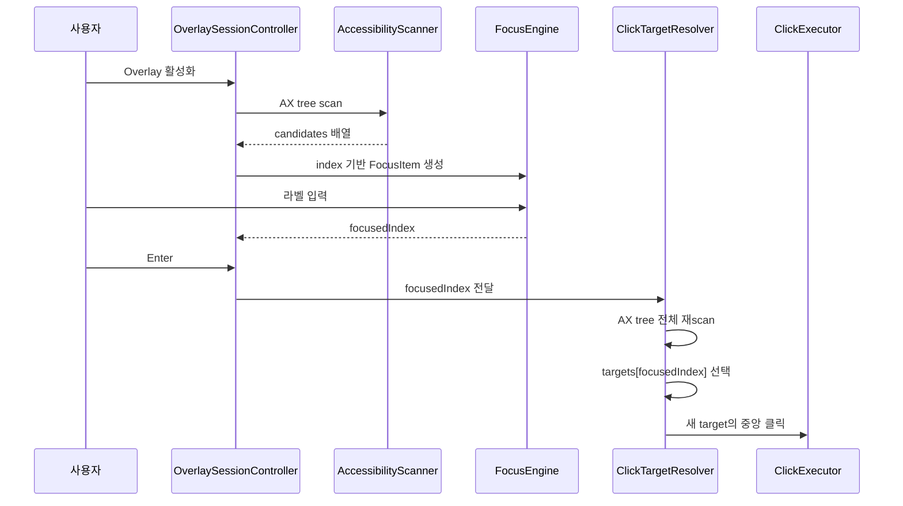
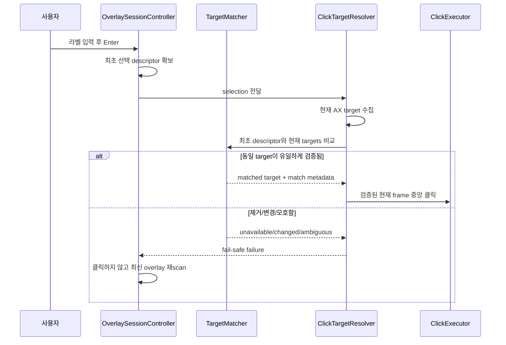

# Overlay 클릭 대상 정합성 및 UX 안정화

## 개요

- **목적**: 웹 화면에서 라벨로 focus한 직후 Enter를 누를 때 표시된 대상과 실제 중앙 클릭 대상이 달라질 수 있는 문제를 제거하고, 오클릭 방지·진단 가능성·밀집 화면 가독성·응답성을 함께 개선한다.
- **대상 사용자**: GazeRow를 이용해 Chrome, Safari, Electron/WebView 앱 및 일반 macOS 앱을 키보드로 조작하는 사용자
- **작성일**: 2026-07-14
- **작성자**: suho.do
- **상태**: 기획중
- **우선순위**: P0 클릭 정확성, P1 진단/가독성, P2 성능/문구 정합성
- **기준 브랜치**: `codex/settings-readiness-ux`
- **기준 커밋**: `fa3ff06 Improve overlay activation capture and click targeting`

## 구현 에이전트 필독

이 문서는 구현을 다른 모델에 위임하기 위한 작업 명세다. 아래 규칙을 먼저 지킨다.

1. 작업 시작 전에 `git status --short`, `git diff`, `git log -5 --oneline`을 확인한다.
2. 현재 작업 트리에는 이 문서 작성 전부터 아래 9개 파일에 미커밋 변경이 있다. 사용자 변경으로 취급하고 덮어쓰거나 되돌리지 않는다.
   - `Sources/GazeRow/Clicking/ClickExecutor.swift`
   - `Sources/GazeRow/Overlay/OverlayAppearance.swift`
   - `Sources/GazeRow/Overlay/OverlayModels.swift`
   - `Sources/GazeRow/Overlay/OverlayView.swift`
   - `Sources/GazeRow/Overlay/OverlayWindowController.swift`
   - `Tests/GazeRowTests/ClickExecutorTests.swift`
   - `Tests/GazeRowTests/OverlayAppearanceTests.swift`
   - `Tests/GazeRowTests/OverlayLayoutEngineTests.swift`
   - `Tests/GazeRowTests/OverlayModelsTests.swift`
3. 함수 수정/추가 시 테스트를 반드시 동시에 작성한다.
4. 새 타입이나 문서 주석에 작성자가 필요하면 `@author suho.do`만 사용한다.
5. P0 정확성 수정과 P2 성능 리팩터링을 한 번에 섞지 않는다. 정확성 테스트를 먼저 통과시킨 뒤 다음 단계로 진행한다.
6. 단순 지연 시간 증가로 문제를 숨기지 않는다. `Thread.sleep` 증가, Enter debounce 추가, 임의 재시도만으로 완료 처리하면 안 된다.
7. 클릭 대상이 확실하지 않으면 **클릭하지 않는 것**이 기본 정책이다.

## 문제 정의

### 사용자 증상

1. Overlay에서 라벨을 입력하거나 gaze/키보드 이동으로 특정 요소를 focus한다.
2. focus 직후 Enter를 누른다.
3. 선택한 라벨이 표시된 요소의 중앙이 아닌 다른 곳이 클릭되거나, 웹 입력 요소가 focus만 되고 기대한 클릭 반응이 나오지 않는 것처럼 보인다.
4. 잠시 기다렸다가 Enter를 누르면 빈도가 낮아지는 것처럼 느껴질 수 있다.

### 기대 동작

- Enter는 화면에서 선택 상태로 보인 **동일한 요소**를 클릭해야 한다.
- 클릭 좌표는 동일한 요소의 검증된 현재 frame 중앙이어야 한다.
- 최초 scan 이후 요소가 사라지거나 크게 이동하거나 식별이 모호해졌다면 클릭하지 않아야 한다.
- 대상 불일치 시 overlay를 최신 상태로 재스캔하고 사용자에게 짧은 안내를 보여야 한다.
- 키를 빠르게 연속 입력해도 label focus와 Enter confirm 순서가 바뀌면 안 된다.

## 조사 결과

### 확인된 사실

| 항목 | 근거 | 의미 |
|---|---|---|
| 라벨 ID는 최초 후보 배열 index다 | `Sources/GazeRow/Overlay/OverlayLayoutEngine.swift:47-52` | 라벨 자체에 AX element identity가 없다. |
| focus 상태도 같은 index를 보관한다 | `Sources/GazeRow/Focus/FocusEngine.swift:96-104` | UI 선택 상태는 최초 snapshot 기준이다. |
| Enter는 `focusedItemID`를 click executor에 넘긴다 | `Sources/GazeRow/Runtime/OverlaySessionController.swift:338-364` | confirm 요청이 index 중심 계약이다. |
| production click executor는 AX 트리를 다시 순회한다 | `Sources/GazeRow/Runtime/OverlaySessionClickExecutor.swift:52-72` | 최초 scan의 element를 그대로 클릭하지 않는다. |
| 재스캔 결과에서도 동일한 숫자 index를 선택한다 | `Sources/GazeRow/Runtime/OverlaySessionClickExecutor.swift:57-63` | 후보 삽입·삭제·순서 변경 시 다른 요소가 선택될 수 있다. |
| 현재 focused AX element가 추가 root 구성에 영향을 준다 | `Sources/GazeRow/Scanning/AXAccessibilityElementClient.swift:40-59` | focus 변화가 traversal 시작점과 후보 순서를 바꿀 수 있다. |
| WebView/Electron 대응을 위해 여러 child attribute를 합친다 | `Sources/GazeRow/Scanning/AccessibilityChildAttributeCollector.swift:47-59` | `AXVisibleChildren`, `AXSelectedChildren` 등의 변화가 후보 순서를 바꿀 수 있다. |
| scan cache key에 focused element나 UI revision이 없다 | `Sources/GazeRow/Runtime/CachingScanner.swift:30-37`, `:72-83` | 같은 창에서 focus만 바뀌면 최대 0.5초 동안 오래된 snapshot이 재사용될 수 있다. |
| 빠른 label→Enter 입력은 FIFO로 전달된다 | `Tests/GazeRowTests/OverlayWindowControllerTests.swift:300-319` | Enter가 label 입력보다 먼저 처리되는 단순 경쟁 상태는 우선순위가 낮다. |
| 좌표 이벤트 발행 성공을 클릭 성공으로 취급한다 | `Sources/GazeRow/Clicking/AXClickExecutionClient.swift:49-74` | 의도한 요소가 반응했는지 검증하지 않는다. |
| overlay 확정 클릭은 모든 대상에 좌표 클릭을 선호한다 | `Sources/GazeRow/Clicking/ClickModels.swift:29-34` | 실제 좌표가 잘못 매핑되면 AX action보다 오클릭 영향이 직접적이다. |

### 가장 유력한 근본 원인

최초 scan의 후보 배열과 Enter 시점 재스캔의 후보 배열을 안정적인 identity 없이 숫자 index로만 연결한다. 웹 페이지에서 focus, hover 유사 상태, selected children, editable ancestor 또는 렌더링 변경으로 AX tree가 달라지면 같은 index가 다른 요소를 가리킨다.

예시:

```text
최초 scan:  [A, B, C, D]
라벨 선택:  C => focusedIndex 2

focus 후 AX tree 변경: [X, A, B, C, D]
Enter 재scan index 2:  B

결과: C 라벨을 선택했지만 B의 현재 frame 중앙을 클릭
```

### 증상을 악화시키는 조건

- 입력 필드 focus 후 editable/focusable ancestor가 추가 root로 노출되는 경우
- 웹 페이지가 focus 스타일, 자동완성, 팝오버, tooltip을 동적으로 추가하는 경우
- 동일 창에서 overlay를 빠르게 재활성화해 0.5초 scan cache가 재사용되는 경우
- 동일 frame에 중첩된 link/button/image/row가 여러 AX attribute로 노출되는 경우
- 선택 대상이 작고 주변에 다른 클릭 후보가 밀집한 경우

### 현재 테스트가 놓치는 범위

현재 테스트는 다음을 검증한다.

- 정적인 AX tree에서 scanner와 click resolver의 순서 일치
- additional root가 존재할 때 두 traversal의 정적 순서 일치
- label 입력과 Enter command의 FIFO 전달
- 전달된 `focusedIndex`가 click executor에 도착하는지 여부

하지만 다음은 검증하지 않는다.

- 최초 scan 이후 Enter 재스캔 전에 후보가 앞쪽에 삽입되는 경우
- focused element 변화로 additional root 개수나 순서가 달라지는 경우
- 동일 index의 role/title/frame이 다른 요소로 바뀐 경우
- 선택 요소가 제거되거나 크게 이동한 경우
- 동일 signature를 가진 후보가 두 개라 식별이 모호한 경우
- 좌표 이벤트 성공 후 의도한 target에 도달했는지 여부

## 처리 흐름

### 현재 흐름



### 목표 흐름



## 범위

### 필수 기능 (Must Have)

- [ ] Enter click 계약을 `focusedIndex` 단독 전달에서 `OverlayClickSelection` 전달로 변경한다.
- [ ] selection에 최초 candidate descriptor와 최초 candidate count를 포함한다.
- [ ] 재스캔 후 동일 index를 무조건 선택하는 코드를 제거한다.
- [ ] 현재 target과 최초 descriptor를 비교하는 순수 matcher를 추가한다.
- [ ] 검증된 target이 하나일 때만 좌표 클릭을 수행한다.
- [ ] 대상이 제거·변경·모호해졌으면 좌표 이벤트를 발행하지 않는다.
- [ ] 불일치 시 scan cache를 무효화하고 overlay를 최신 후보로 다시 표시한다.
- [ ] 초기 frame과 현재 frame의 중심 이동량을 계산하고 허용 범위를 넘으면 클릭하지 않는다.
- [ ] raw title/value/help를 남기지 않는 진단 로그를 추가한다.
- [ ] 동적 후보 재정렬, 삽입, 삭제, 이동, 모호성 테스트를 추가한다.
- [ ] 빠른 focus→Enter 입력에 대한 회귀 테스트를 유지한다.
- [ ] 현재 중앙 라벨 배치 계약을 유지한다.
- [ ] 한국어/영어 오류 안내를 모두 제공한다.

### 후속 필수 개선 (P1)

- [ ] 명시적으로 라벨을 선택한 뒤에는 선택되지 않은 라벨을 dim 처리한다.
- [ ] 부분 label buffer가 있을 때 prefix가 일치하지 않는 라벨을 dim 또는 숨김 처리한다.
- [ ] collision/occlusion metrics를 실제 표현 정책에 반영한다.
- [ ] interaction 로그에 click method와 target match 결과를 개인정보 없이 기록한다.
- [ ] 실제 coordinate-first 정책과 Settings/Known Limitations 문구를 일치시킨다.

### 선택 기능 (Nice to Have)

- [ ] `AXUIElement` runtime identity를 후보에 연결해 semantic/spatial fallback보다 먼저 사용한다.
- [ ] 클릭 지점의 AX hit-test 결과가 선택 대상 또는 허용 가능한 ancestor/descendant인지 검증한다.
- [ ] AX scan과 click target resolution을 전용 serial actor/queue로 이동한다.
- [ ] 매 상태 변경마다 `NSHostingView`를 재생성하지 않고 observable state로 업데이트한다.
- [ ] 앱별 동적 AX tree 통합 fixture를 추가한다.

### 범위 제외 (Non-goals)

- 자동 클릭 또는 dwell click 추가
- 위험 action의 second confirm 정책 전면 개편
- gaze calibration 알고리즘 변경
- AX 후보 수집 role 전체 재설계
- 라벨을 다시 adaptive 위치로 전면 이동
- 사용자 입력 원문이나 window title을 진단 로그에 저장

## 상세 설계

### 1. 선택 모델 도입

새 모델은 최초 scan에서 사용자가 실제로 본 대상 정보를 보존한다.

권장 형태:

```swift
struct OverlayClickSelection: Equatable {
    let labelID: Int
    let candidate: ClickableCandidate
    let sourceCandidateCount: Int
}
```

설계 규칙:

- `labelID`는 UI/로그 상관관계 확인용이며 target 선택의 유일한 근거로 사용하지 않는다.
- `candidate`는 최초 표시 당시 role, subrole, title, frame, actions를 가진다.
- `sourceCandidateCount`는 재스캔 전후 후보 개수 변화 진단에 사용한다.
- title은 메모리 비교에는 사용할 수 있지만 raw 값을 OSLog/파일 로그에 출력하면 안 된다.
- 향후 runtime identity가 추가되더라도 descriptor fallback은 유지한다.

`OverlaySessionClickExecuting` 권장 계약:

```swift
protocol OverlaySessionClickExecuting {
    func execute(
        selection: OverlayClickSelection,
        context: TargetContext,
        isSecondConfirmProvided: Bool
    ) -> Result<ClickExecutionSuccess, OverlaySessionClickFailure>
}
```

`OverlaySessionController.executeClickIfPossible`에서는 `focusedItemID`로 `session.snapshot.scanResult.candidates`를 안전하게 조회해 selection을 만든다. index가 snapshot 범위를 벗어나면 즉시 실패시키고 executor를 호출하지 않는다.

### 2. Target matcher 분리

matcher는 AX framework에 의존하지 않는 순수 타입으로 만든다. 테스트에서 `ClickTarget<Int>` 같은 in-memory target을 사용할 수 있어야 한다.

권장 타입:

```swift
struct OverlayClickTargetMatcher {
    func match<Element>(
        selection: OverlayClickSelection,
        currentTargets: [ClickTarget<Element>]
    ) -> OverlayClickTargetMatch<Element>
}
```

결과 예시:

```swift
enum OverlayClickTargetMatch<Element> {
    case matched(target: ClickTarget<Element>, metadata: OverlayClickTargetMatchMetadata)
    case unavailable
    case changed
    case ambiguous
}
```

`OverlayClickTargetMatchMetadata`에는 다음처럼 민감하지 않은 정보만 둔다.

- match strategy: `validatedOriginalIndex`, `descriptor`, `runtimeIdentity`
- source/current candidate count
- source/current index
- center distance
- frame intersection ratio 또는 IoU
- role/subrole/title-presence/actions match boolean

### 3. 매칭 규칙

다음 순서로 적용한다.

#### 3.1 기존 index fast path

현재 배열에 `selection.labelID`가 존재해도 바로 반환하지 않는다. 해당 target이 아래 validation을 모두 통과할 때만 fast path로 인정한다.

- role 동일
- 최초 subrole이 존재하면 subrole 동일
- 최초 title과 현재 title이 모두 비어 있지 않으면 normalized title 동일
- frame 중심 거리 허용 범위 이내
- frame 크기가 비정상적으로 달라지지 않음

#### 3.2 descriptor fallback

기존 index validation이 실패하면 전체 target에서 아래 hard filter를 적용한다.

- role 동일
- secure text field 아님
- 최초 subrole이 존재하면 subrole 동일
- 최초 title이 존재하면 normalized title 동일
- 최초 title이 없다면 actions 교집합 또는 subrole 중 하나가 일치
- frame이 최초 frame과 충분히 가깝거나 겹침

그 후 다음 우선순위로 정렬한다.

1. runtime identity exact match가 구현된 경우 이를 최우선
2. normalized title exact match
3. frame IoU가 큰 대상
4. center distance가 작은 대상
5. actions 일치도가 높은 대상

최상위 후보가 둘 이상 사실상 동점이면 `ambiguous`를 반환한다. 배열의 첫 번째 요소를 임의로 선택하면 안 된다.

#### 3.3 frame drift 정책

기본 정책은 보수적으로 시작한다.

- 중심 이동량 `<= 12pt`: 동일 요소로 허용 가능
- 중심 이동량 `> 12pt`: runtime identity exact match가 없다면 `changed`
- 크기 변화가 있더라도 중심이 유지되고 semantic signature가 같으면 허용 가능
- 임계값은 `OverlayClickTargetMatchConfiguration`으로 분리하고 테스트에서 주입 가능하게 한다.
- 실제 웹 검증 후 수치를 조정하되, 지연 추가로 대신하지 않는다.

#### 3.4 normalize 규칙

- 앞뒤 공백 제거
- 연속 whitespace 하나로 축약
- 대소문자 비교는 locale-independent case-insensitive
- 빈 문자열은 nil과 동일하게 취급
- raw title은 로그에 기록하지 않음

### 4. Fail-safe 오류 처리

`OverlaySessionClickFailure`에 index 부족 외의 의미 있는 오류를 추가한다.

권장 case:

```swift
case selectedTargetUnavailable(labelID: Int)
case selectedTargetChanged(labelID: Int)
case selectedTargetAmbiguous(labelID: Int)
```

오류 처리 계약:

- 위 오류에서는 `ClickExecutor.execute`를 호출하지 않는다.
- coordinate mouseDown/mouseUp이 한 번도 발행되지 않아야 한다.
- `lastClickResult`와 observer에는 failure를 전달한다.
- interaction 로그에는 `clickAttempt`를 기록하되 `clickCompleted(success: false)`를 기록한다.
- scanner cache를 무효화한다.
- target app을 다시 resolve/scan하고 overlay를 갱신한다.
- 재스캔 실패 시 기존 session을 유지하되 failure 안내를 표시한다.
- 무한 자동 재시도는 금지한다. 한 번 재스캔 후 사용자 Enter를 다시 기다린다.

사용자 안내 문구:

| 상황 | 한국어 | 영어 |
|---|---|---|
| target 변경 | 화면이 변경되어 라벨을 갱신했습니다. 다시 선택하세요. | The screen changed, so labels were refreshed. Select again. |
| target 제거 | 선택한 요소가 더 이상 없습니다. 라벨을 갱신했습니다. | The selected element is no longer available. Labels were refreshed. |
| target 모호 | 대상을 확실히 구분할 수 없어 클릭하지 않았습니다. | The target could not be identified safely, so no click was performed. |
| rescan 실패 | 화면을 다시 읽지 못했습니다. 잠시 후 다시 시도하세요. | The screen could not be rescanned. Try again shortly. |

문구는 `AppContent.Localized` 또는 기존 localization SSOT에 추가한다. controller에 한국어/영어 문자열을 직접 분기하지 않는다.

### 5. 진단 로그

현재 interaction file log는 개인정보 보호를 위해 최소 필드만 저장한다. 이 원칙은 유지한다.

OSLog에 추가할 수 있는 필드:

- label ID
- source/current candidate count
- source/current candidate index
- source/current frame의 정수 좌표
- center delta 정수값
- role
- subrole 존재 여부 또는 공개 가능한 subrole
- title match boolean (raw title 금지)
- match strategy
- match result
- click method
- target resolution duration

로그 예시:

```text
click match label=42 result=matched strategy=descriptor sourceCount=118 currentCount=121 sourceIndex=42 currentIndex=45 centerDelta=2 role=AXButton titleMatch=true
```

금지 항목:

- raw title
- text field value
- query 문자열
- raw window title
- URL
- 사용자가 입력한 문장

`InteractionEvent` 파일 포맷 확장은 별도 versioning 없이 optional field로만 추가하거나, 기존 이벤트 호환성을 깨지 않는 새 event type으로 추가한다.

### 6. scan cache 정책

P0 구현에서 cache 자체를 무조건 제거하지는 않는다. 대신 아래 안전장치를 적용한다.

- 캐시된 snapshot으로 라벨이 표시되더라도 Enter 시 descriptor validation을 반드시 수행한다.
- validation 실패 시 cache를 즉시 무효화하고 한 번 재스캔한다.
- 동일 target window라도 source/current candidate count가 달라졌음을 로그로 남긴다.
- 후속 단계에서 focused element identity 또는 UI revision을 cache key에 포함할 수 있는지 검토한다.
- 검증 가능한 focus token이 없다면 웹 앱에 한해 cache TTL을 0으로 만드는 앱별 예외보다, 활성화 시 live validation을 우선한다.

### 7. 중앙 라벨 유지 및 밀집 화면 declutter

사용자 요구에 따라 라벨 기본 위치는 candidate 중앙을 유지한다. 전역 adaptive 배치로 되돌리지 않는다.

가독성 개선 규칙:

- 부분 label buffer가 비어 있지 않으면 prefix가 일치하지 않는 라벨 opacity를 `0.10...0.20` 범위로 낮춘다.
- exact label jump, gaze focus, Tab/arrow focus처럼 사용자가 명시적으로 focus를 이동한 뒤에는 focused label을 1.0으로 유지하고 나머지는 낮춘다.
- 최초 overlay 표시 시 첫 번째 item이 내부적으로 focus되어 있더라도 이를 명시적 사용자 선택으로 간주하지 않는다.
- 명시적 focus 여부를 별도 상태로 표현한다. `focusedLabel != nil`만으로 판단하지 않는다.
- target marker outline은 남겨도 되지만 비선택 marker fill은 더 낮춰 콘텐츠 가림을 줄인다.
- `collisionCount`와 `occlusionCount`가 높을 때 label 크기나 위치를 임의로 바꾸지 말고 declutter 강도를 높이는 입력으로 사용한다.
- 선택 라벨 배경 opacity는 기존 사용자 설정을 존중하고, focused label도 해당 설정에서 일정 범위만 가산한다.

권장 상태 모델:

```swift
enum OverlayFocusOrigin: Equatable {
    case initial
    case label
    case keyboard
    case gaze
    case query
}
```

`OverlayInteractionStatus`에 focus origin 또는 `hasExplicitFocus`를 추가할 경우 모든 생성 지점과 테스트를 갱신한다.

### 8. 클릭 성공 의미 정리

현재 `CGEvent.post`가 성공하면 실제 target 반응과 무관하게 `ClickExecutionSuccess`가 된다. 즉 "이벤트 발행 성공"과 "의도한 UI 동작 성공"이 섞여 있다.

이번 P0에서 최소한 다음을 구분한다.

- target match 성공
- click event 발행 성공
- 실제 UI state change 확인 여부는 unknown

가능하면 success metadata에 `targetMatchStrategy`를 포함한다. 실제 UI state change를 검증하지 않는 한 사용자 문구와 로그에서 "정확한 동작 완료"로 과도하게 표현하지 않는다.

후속으로 AX hit-test 또는 focused element 변화 검증을 추가할 수 있다. 다만 버튼 클릭 후 페이지 이동처럼 결과가 다양한 동작을 하나의 방식으로 판정하려고 하지 않는다.

### 9. 메인 스레드 응답성

현재 관련 경로는 `@MainActor`에서 다음 동기 작업을 수행한다.

- 최대 4,000 node, 1.5초 timeout의 AX traversal
- Enter 시 두 번째 AX traversal
- target app 활성화 후 `Thread.sleep(0.06)`
- mouseDown과 mouseUp 사이 `Thread.sleep(0.035)`
- status 변경마다 target/command bar의 `NSHostingView` 재생성

P0 정확성 수정 후 별도 단계로 처리한다.

권장 방향:

- AX 작업을 전용 serial executor/actor로 격리하되 AX API의 thread/actor 제약을 먼저 확인한다.
- main actor에는 상태 반영과 panel 업데이트만 남긴다.
- 동기 sleep을 async clock/scheduler로 교체한다.
- click 실행 중 중복 Enter를 명시적 phase로 막는다.
- `NSHostingView`는 한 번 생성하고 observable model을 변경하는 방식으로 전환한다.
- 성능 리팩터링 전후 activation/confirm p50, p95 시간을 로그로 비교한다.

## 파일별 예상 수정 범위

| 파일 | 예상 변경 |
|---|---|
| `Sources/GazeRow/Runtime/OverlaySessionClickExecutor.swift` | index 기반 executor 계약을 selection 기반으로 변경, matcher 연결, mismatch failure 및 진단 로그 추가 |
| `Sources/GazeRow/Runtime/OverlaySessionController.swift` | focused candidate로 selection 생성, fail-safe rescan, localized status 처리 |
| `Sources/GazeRow/Scanning/AccessibilityScanModels.swift` | 필요 시 candidate descriptor/runtime identity 관련 모델 보강 |
| `Sources/GazeRow/Scanning/AccessibilityElementClient.swift` | optional runtime identity를 도입하는 경우 client 계약 추가 |
| `Sources/GazeRow/Scanning/AXAccessibilityElementClient.swift` | runtime identity 또는 hit-test를 구현하는 경우 production 구현 추가 |
| `Sources/GazeRow/Clicking/ClickModels.swift` | click success/failure metadata 및 coordinate-first 용어 정리 |
| `Sources/GazeRow/Overlay/OverlayModels.swift` | explicit focus/declutter 상태 추가 |
| `Sources/GazeRow/Overlay/OverlayView.swift` | prefix/explicit focus 기반 비선택 라벨 dim 처리 |
| `Sources/GazeRow/Overlay/OverlayWindowController.swift` | 새 status 전달, 후속 단계에서 stable hosting view 적용 |
| `Sources/GazeRow/Infrastructure/AppContent.swift` | target changed/ambiguous/rescan 문구 및 click policy 안내 현행화 |
| `Sources/GazeRow/Logging/InteractionEvent.swift` | 호환 가능한 match/click method 계측이 필요한 경우 확장 |
| `Sources/GazeRow/Runtime/CachingScanner.swift` | mismatch invalidation 계측 또는 후속 focus-aware cache key |

예상 테스트 파일:

| 파일 | 필수 테스트 |
|---|---|
| `Tests/GazeRowTests/OverlaySessionClickTargetResolverTests.swift` | 후보 삽입/삭제/재정렬/이동/모호성/추가 root 변경 |
| `Tests/GazeRowTests/OverlaySessionControllerTests.swift` | selection 생성, mismatch에서 click 미호출, cache invalidation, rescan 상태 |
| `Tests/GazeRowTests/ClickExecutorTests.swift` | 검증된 target 중앙 좌표, coordinate-first 기존 동작 회귀 |
| `Tests/GazeRowTests/CachingScannerTests.swift` | mismatch 후 invalidation 또는 새 cache key 동작 |
| `Tests/GazeRowTests/OverlayModelsTests.swift` | explicit focus/declutter 상태 기본값과 경계값 |
| `Tests/GazeRowTests/OverlayLayoutEngineTests.swift` | centered 계약 유지, collision metrics 유지 |
| `Tests/GazeRowTests/OverlayWindowControllerTests.swift` | 빠른 label→Enter FIFO 회귀, 새 status rendering |
| `Tests/GazeRowTests/InteractionEventTests.swift` | optional 진단 field의 인코딩 호환성과 개인정보 비포함 |
| `Tests/GazeRowTests/AppContentTests.swift` | 한국어/영어 새 문구 및 실제 click policy 정합성 |

## 필수 테스트 시나리오

### A. Target matching 단위 테스트

- [ ] 정적 배열에서 동일 index/동일 descriptor는 기존 target을 선택한다.
- [ ] 현재 배열 앞에 새 후보가 삽입돼도 최초 선택 요소를 descriptor로 찾는다.
- [ ] 현재 배열 중간 후보가 삭제돼 index가 당겨져도 최초 선택 요소를 찾는다.
- [ ] additional root가 새로 추가돼 전체 순서가 밀려도 최초 선택 요소를 찾는다.
- [ ] 동일 index의 role이 달라졌으면 해당 index를 사용하지 않는다.
- [ ] title이 있는 후보의 title이 달라졌으면 동일 index라도 사용하지 않는다.
- [ ] 동일 descriptor가 두 개면 ambiguous를 반환한다.
- [ ] 선택 후보가 사라졌으면 unavailable을 반환한다.
- [ ] 중심이 12pt 이내로 이동한 동일 descriptor는 허용한다.
- [ ] 중심이 임계값을 초과해 이동했고 runtime identity가 없으면 changed를 반환한다.
- [ ] runtime identity exact match가 있으면 순서와 작은 frame 변화에 관계없이 우선한다.
- [ ] secure text field는 match 대상이 되지 않는다.

### B. Session/controller 테스트

- [ ] Enter 시 focused ID와 snapshot candidate로 selection을 만든다.
- [ ] focused ID가 candidate 범위를 벗어나면 executor를 호출하지 않는다.
- [ ] target changed failure에서 coordinate click client를 호출하지 않는다.
- [ ] mismatch에서 scanner cache를 무효화한다.
- [ ] mismatch 후 overlay를 한 번 재스캔하고 새 layout을 표시한다.
- [ ] 재스캔 성공 후 자동 클릭하지 않고 사용자 입력을 기다린다.
- [ ] 재스캔 실패 시 명확한 failure 상태를 표시한다.
- [ ] success 경로는 기존처럼 cache 무효화 후 overlay를 닫는다.
- [ ] risky second confirm은 동일 selection에만 유효하다.
- [ ] 첫 confirm과 두 번째 confirm 사이 selection이 바뀌면 pending confirm을 폐기한다.

### C. 입력 및 UI 테스트

- [ ] label keyDown과 Enter keyDown을 연속 전달하면 FIFO 순서를 유지한다.
- [ ] exact label jump 직후 Enter가 최신 focus selection을 사용한다.
- [ ] 최초 내부 focus 상태에서는 다른 라벨을 dim하지 않는다.
- [ ] explicit focus 이후에는 focused label만 완전 opacity를 유지한다.
- [ ] 부분 prefix 입력에서 불일치 라벨이 dim 처리된다.
- [ ] centered label frame은 candidate midpoint를 유지한다.
- [ ] 사용자가 설정한 label background opacity가 focused/unfocused 모두 반영된다.

### D. 로그/개인정보 테스트

- [ ] target match 로그에 raw title/value/query/window title이 포함되지 않는다.
- [ ] candidate count, index, frame delta, role, match result는 기록된다.
- [ ] coordinate event 발행 실패는 completed false로 기록된다.
- [ ] target mismatch도 completed false로 기록된다.
- [ ] 기존 interaction JSONL decoder/테스트와 호환된다.

## 수동 재현 및 검증 매트릭스

최소 다음 앱/요소로 검증한다.

| 앱 | 대상 | 빠른 Enter | 대기 후 Enter | 확인 항목 |
|---|---|---:|---:|---|
| Chrome | 검색 입력, 링크, 동적 메뉴 버튼 | 필수 | 필수 | 선택 label과 click point 일치 |
| Safari | 주소/검색 입력, 웹 링크 | 필수 | 필수 | focus 후 추가 AX root 변화 대응 |
| Codex/Electron 계열 | 사이드바 row, 편집 입력, toolbar button | 필수 | 필수 | selected/visible children 순서 변화 대응 |
| VS Code | Activity Bar, editor tab | 필수 | 필수 | 깊은 AX tree와 추가 root 대응 |
| Finder | sidebar row, toolbar button | 필수 | 필수 | 기존 native app 회귀 없음 |
| System Settings | toggle, row | 필수 | 필수 | state change target 회귀 없음 |

수동 검증 절차:

1. 앱을 최신 local bundle로 다시 빌드하고 서명한다.
2. 대상 앱을 frontmost로 둔다.
3. overlay를 연다.
4. 작은 버튼과 입력 필드 각각에서 라벨을 입력한다.
5. 라벨 focus 후 300ms 이내 Enter를 누르는 테스트를 10회 반복한다.
6. 같은 대상을 1초 대기 후 Enter로 10회 반복한다.
7. 동적 메뉴/자동완성 패널이 열린 상태에서도 반복한다.
8. 잘못된 target click이 한 번이라도 발생하면 실패로 판정한다.
9. target 변경이 감지된 경우 클릭이 발생하지 않고 overlay가 새로 표시되는지 확인한다.
10. OSLog에서 source/current index, candidate count, center delta를 확인한다.

주의:

- 실제 계정 삭제, 전송, 결제 등 위험한 버튼은 수동 검증 대상으로 사용하지 않는다.
- 테스트용 페이지 또는 되돌릴 수 있는 탐색/입력 요소를 사용한다.
- cursor가 원래 위치로 복귀하므로 클릭 지점은 로그와 화면 반응을 함께 확인한다.

## 빌드 및 검증 명령

```bash
# 포맷/patch 오류
git diff --check

# 관련 단위 테스트
DEVELOPER_DIR=/Applications/Xcode.app/Contents/Developer \
  swift test --filter OverlaySessionClickTargetResolverTests

DEVELOPER_DIR=/Applications/Xcode.app/Contents/Developer \
  swift test --filter OverlaySessionControllerTests

DEVELOPER_DIR=/Applications/Xcode.app/Contents/Developer \
  swift test --filter ClickExecutorTests

# 전체 테스트
DEVELOPER_DIR=/Applications/Xcode.app/Contents/Developer swift test

# 빌드
DEVELOPER_DIR=/Applications/Xcode.app/Contents/Developer swift build

# 실행용 앱 번들 재생성 및 서명
DEVELOPER_DIR=/Applications/Xcode.app/Contents/Developer scripts/build_local_app.sh
scripts/sign_local_app.sh .build/local-app/GazeRow.app

# 기존 GazeRow 종료 후 최신 bundle 실행
open -n .build/local-app/GazeRow.app
```

앱을 재실행할 때 `swift build`만 수행하고 기존 `.build/local-app/GazeRow.app`을 열면 이전 binary가 실행될 수 있다. 반드시 `scripts/build_local_app.sh`로 bundle을 다시 만든다.

## 완료 기준 (Definition of Done)

### P0 클릭 정확성

- [ ] production 코드에서 재스캔 배열의 `targets[focusedIndex]`를 validation 없이 사용하는 경로가 없다.
- [ ] 후보 삽입/삭제/재정렬에도 동일 descriptor target이 선택된다.
- [ ] target이 제거·변경·모호하면 click event가 발행되지 않는다.
- [ ] mismatch 시 한 번 재스캔하고 새 overlay를 보여준다.
- [ ] 중앙 클릭 좌표는 matcher가 검증한 target의 현재 frame midpoint다.
- [ ] 빠른 label→Enter를 반복해도 의도하지 않은 target click이 발생하지 않는다.

### 테스트

- [ ] 추가/수정한 모든 함수에 대응하는 단위 테스트가 있다.
- [ ] 위 필수 테스트 시나리오가 모두 자동화돼 있다.
- [ ] 전체 `swift test`가 0 failures로 통과한다.
- [ ] `git diff --check`가 통과한다.
- [ ] Finder/Chrome/Safari/Codex 또는 동등한 Electron 앱에서 수동 검증을 완료한다.

### UX/진단

- [ ] mismatch 사용자 안내가 한국어/영어로 노출된다.
- [ ] raw title/value/query/window title을 새 로그에 남기지 않는다.
- [ ] source/current candidate count와 frame delta로 동일 문제를 사후 분석할 수 있다.
- [ ] 중앙 라벨 위치와 사용자 opacity 설정이 유지된다.
- [ ] explicit focus 이후 비선택 라벨이 시각적으로 충분히 약해진다.

### 문서/정책

- [ ] coordinate-first 실제 동작과 Known Limitations/Settings 안내가 일치한다.
- [ ] 코드 주석이 더 이상 "항상 scan 순서가 같으므로 index가 안전하다"는 가정을 표현하지 않는다.
- [ ] 새 public/internal API의 역할과 fail-safe 정책이 주석에 명확하다.

## 작업 순서

### Phase 0: 진단 기반선

- [x] 기존 전체 테스트 실행 및 결과 기록 (`2026-07-14`: 변경 전 607 tests, 진단 추가 후 610 tests, 모두 0 failures)
- [x] 현재 label selection frame과 Enter target frame을 비교하는 개인정보 비포함 로그 추가
- [ ] Chrome/Safari/Electron 중 하나에서 문제 재현 로그 확보

### Phase 1: P0 target consistency

- [x] `OverlayClickSelection` 도입
- [x] click executor protocol 변경
- [x] 순수 `OverlayClickTargetMatcher` 구현
- [x] index fast path validation 구현
- [x] descriptor fallback 및 ambiguous 처리 구현
- [x] resolver/controller 단위 테스트 추가

### Phase 2: Fail-safe refresh

- [x] mismatch failure case 추가
- [x] mismatch에서 click 미발행 보장
- [x] cache invalidation 및 단발 rescan 연결
- [x] 한국어/영어 안내 문구 추가
- [x] second confirm selection 정합성 테스트 추가

### Phase 3: Overlay declutter

- [x] explicit focus 상태 모델 추가
- [x] prefix 불일치 라벨 dim 처리
- [x] explicit focus 이후 비선택 라벨 dim 처리
- [x] centered/opacity 회귀 테스트 추가 (`2026-07-14`: 623 tests, 0 failures)

### Phase 4: 정책 및 진단 정리

- [ ] coordinate-first 용어와 안내 문구 현행화
- [ ] interaction 진단 event 호환 확장
- [ ] raw 사용자 데이터 비포함 테스트 추가

### Phase 5: 성능 후속

- [ ] confirm 재스캔 시간과 UI blocking 측정
- [ ] AX serial executor/actor 타당성 검토
- [ ] sync sleep 제거
- [ ] stable `NSHostingView` 상태 업데이트 전환
- [ ] 전후 p50/p95 비교

## 구현 시 금지 사항

- `targets[focusedIndex]`를 검증 없이 유지
- Enter 입력을 임의로 100ms 이상 지연해 해결됐다고 판단
- title/value/window title을 raw 로그에 기록
- ambiguous match에서 첫 후보를 임의 선택
- target mismatch 후 자동으로 다른 후보를 클릭
- 기존 사용자 opacity 설정을 무시
- 중앙 배치 요구를 전역 adaptive 배치로 되돌림
- 기존 미커밋 변경을 `git checkout`, `git reset`, `git restore`로 제거
- 테스트 없이 protocol/function 시그니처 변경

## 구현 판단이 필요한 항목

다음 항목은 Phase 1 구현 중 작은 spike 후 결정한다.

1. `AXUIElement`의 `CFHash`를 scan과 재스캔 사이 runtime identity로 신뢰할 수 있는지 확인한다.
2. runtime identity가 불안정하면 descriptor + strict frame guard를 P0 기준으로 사용한다.
3. `AXUIElementCopyElementAtPosition` hit-test가 Chrome/Safari/Electron에서 선택 target 또는 ancestor를 안정적으로 반환하는지 확인한다.
4. dedicated actor로 AX 호출을 옮길 때 macOS AX API와 MainActor 제약에 문제가 없는지 확인한다.
5. interaction JSONL에 optional field를 추가할지 별도 event type을 추가할지 기존 decoder 호환성을 기준으로 결정한다.

어느 선택을 하더라도 핵심 완료 조건은 동일하다. **선택 target을 확실히 식별하지 못하면 클릭하지 않는다.**

## 참고 파일

- `Sources/GazeRow/Runtime/OverlaySessionController.swift`
- `Sources/GazeRow/Runtime/OverlaySessionClickExecutor.swift`
- `Sources/GazeRow/Scanning/AccessibilityScanner.swift`
- `Sources/GazeRow/Scanning/AXAccessibilityElementClient.swift`
- `Sources/GazeRow/Scanning/AccessibilityChildAttributeCollector.swift`
- `Sources/GazeRow/Scanning/AccessibilityAdditionalRootElementCollector.swift`
- `Sources/GazeRow/Runtime/CachingScanner.swift`
- `Sources/GazeRow/Focus/FocusEngine.swift`
- `Sources/GazeRow/Clicking/ClickExecutor.swift`
- `Sources/GazeRow/Clicking/AXClickExecutionClient.swift`
- `Sources/GazeRow/Overlay/OverlayLayoutEngine.swift`
- `Sources/GazeRow/Overlay/OverlayView.swift`
- `Tests/GazeRowTests/OverlaySessionClickTargetResolverTests.swift`
- `Tests/GazeRowTests/OverlaySessionControllerTests.swift`
- `Tests/GazeRowTests/OverlayWindowControllerTests.swift`
