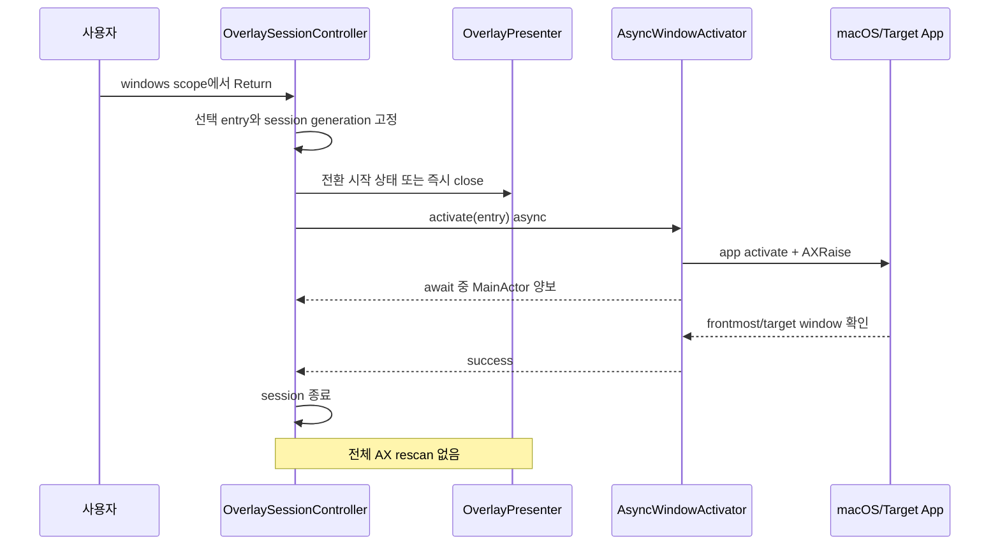
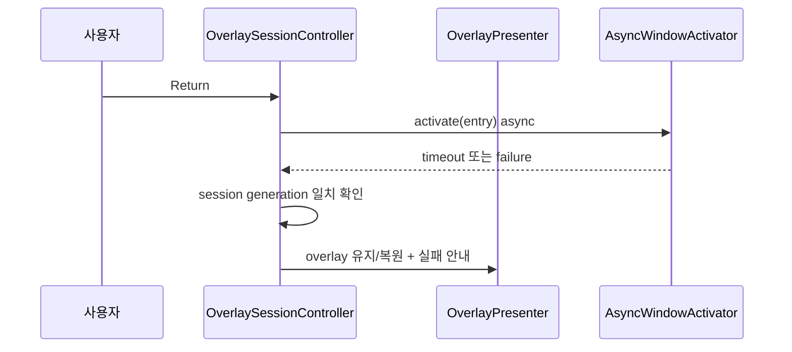

# 창 전환 지연 개선

## 개요

- **목적**: Query Overlay의 windows scope에서 사용자가 창을 선택하고 `Return`을 누른 뒤 대상 창이 실제로 전면에 나타날 때까지 발생하는 지연과 UI 멈춤을 제거한다.
- **대상 사용자**: gazerow의 `;` 창 검색을 이용해 실행 중인 앱과 창을 키보드로 전환하는 사용자
- **작성일**: 2026-07-14
- **작성자**: suho.do
- **상태**: 기획중
- **우선순위**: P0 메인 스레드 블로킹 제거, P0 불필요한 재스캔 제거, P1 창 인덱스 캐시, P1 성능 계측
- **기준 브랜치**: `codex/settings-readiness-ux`
- **기준 커밋**: `38aecea 확정 클릭 성능 측정과 렌더링 최적화`

## 구현 에이전트 필독

1. 작업 시작 전에 `git status --short`, `git log -5 --oneline`, 실행 중인 gazerow 프로세스 수를 확인한다.
2. 설치본과 로컬 빌드가 동시에 실행 중이면 성능 수치를 채택하지 않는다. 두 프로세스가 전역 입력과 overlay를 동시에 처리하면 측정 결과가 오염된다.
3. 함수 수정 또는 추가 시 단위 테스트를 반드시 함께 작성한다.
4. 새 타입이나 문서 주석에 작성자가 필요하면 `@author suho.do`만 사용한다.
5. `Thread.sleep` 시간을 줄이거나 timeout을 짧게 만드는 것만으로 완료 처리하지 않는다. 메인 스레드에서 동기 대기가 사라져야 한다.
6. 성능 개선을 이유로 창 활성화 성공 검증을 제거하지 않는다. 성공 판정은 대상 앱과 가능하면 대상 창까지 확인해야 한다.
7. phase별로 테스트를 통과시킨 후 한글 커밋 메시지로 커밋하고 원격 브랜치에 푸시한다.
8. PR #3 충돌 해결은 이 문서 구현과 별도로 먼저 끝낸다. 충돌 해결과 성능 변경을 같은 커밋에 섞지 않는다.

## 문제 정의

### 사용자 증상

1. Overlay를 열고 `;`를 눌러 windows scope로 진입한다.
2. 앱 또는 창 이름을 입력하고 후보를 선택한다.
3. `Return`을 누른다.
4. 대상 창이 나타나기까지 체감상 오래 걸리거나, 그동안 overlay와 키 입력이 멈춘 것처럼 보인다.
5. 앱 또는 대상 창에 따라 지연 시간이 일정하지 않다.

### 기대 동작

- `Return` 입력 직후 현재 overlay가 즉시 반응해야 한다.
- 대상 앱이 이미 실행 중이면 일반적인 창 전환은 사용자가 즉각적으로 느낄 수 있는 시간 안에 완료돼야 한다.
- 창 활성화를 기다리는 동안 메인 스레드, SwiftUI 렌더링, 키 이벤트 처리가 정지하면 안 된다.
- 단순 창 전환 뒤에는 새 창의 전체 접근성 트리를 자동으로 다시 스캔하지 않아야 한다.
- 활성화 실패 시에만 기존 overlay를 유지하거나 복원하고, 사용자가 재시도할 수 있는 오류를 표시해야 한다.

## 확인된 병목

### 1. `@MainActor`에서 동기 polling

`WindowActivating`과 `WindowActivator`는 `@MainActor`에 격리돼 있다.

```swift
@MainActor
protocol WindowActivating {
    func activate(_ entry: WindowEntry) -> Result<Void, WindowActivateFailure>
}
```

기본 `sleep` 구현은 `Thread.sleep(forTimeInterval:)`이며, 대상 앱이 frontmost가 될 때까지 50ms 간격으로 최대 1초 동안 반복한다.

```swift
sleep: @escaping (TimeInterval) -> Void = { Thread.sleep(forTimeInterval: $0) }
maxPollDuration: TimeInterval = 1.0
pollInterval: TimeInterval = 0.05
```

이 대기는 단순히 현재 함수만 기다리는 것이 아니라 메인 스레드를 점유한다. 대기 중에는 다음 작업이 지연될 수 있다.

- overlay 상태 렌더링
- panel 표시 및 닫기
- 로컬 키 이벤트 처리
- 메뉴바 UI 처리
- 다음 MainActor task 실행

bundle ID가 비어 있는 entry는 성공 검증 대신 고정 300ms를 기다린다. 이 경로도 실제 상태와 관계없이 UI를 멈춘다.

### 2. 전환 직후 scan cache 강제 무효화

창 활성화가 성공하면 `OverlaySessionController.activateFocusedWindow`는 바로 `rescanFrontmost`를 호출한다.

```text
Return
  -> WindowActivator.activate
  -> frontmost polling
  -> scanner.invalidate
  -> TargetResolver.resolve
  -> AccessibilityScanner.scan
  -> OverlayLayoutEngine.makeLayout
  -> 새 OverlaySessionState 생성
  -> panel 재표시
```

`rescanFrontmost`는 기존 scan cache를 무조건 삭제한다. 새 창으로 전환만 하려는 사용자에게는 필요하지 않은 전체 접근성 탐색과 overlay 재생성이 추가된다.

### 3. 접근성 트리 전체 재스캔

기본 스캔 한도는 다음과 같다.

| 항목 | 현재 기본값 |
|---|---:|
| 최대 깊이 | 28 |
| 최대 노드 | 4,000 |
| timeout | 1.5초 |

Chrome, Codex, Electron 앱처럼 접근성 트리가 크거나 응답이 느린 앱에서는 창 활성화 polling 뒤에 최대 1.5초의 scan이 직렬로 이어질 수 있다.

이론상 주요 직렬 지연 상한은 다음과 같다.

```text
창 활성화 polling 약 1.0초
+ 대상 resolve 및 AX 호출
+ 전체 scan 약 1.5초
+ layout 및 panel 렌더링
= 2.5초 이상 가능
```

### 4. 창 검색 index의 동기 생성

windows scope에 처음 진입할 때 `WindowSearchIndex.build()`가 실행 중인 모든 regular application을 순회한다.

각 앱에 대해 다음 접근성 조회가 동기 실행된다.

- `kAXWindowsAttribute`
- 각 창의 title
- 앱 아이콘과 기본 메타데이터

index는 한 overlay session 안에서 최대 30초 동안만 재사용된다. overlay를 닫고 다시 열면 새 session에서 다시 구축될 수 있다.

### 5. 단일 인스턴스가 보장되지 않음

현재 설치본과 로컬 빌드를 동시에 실행할 수 있다. 두 프로세스가 각각 전역 단축키, event tap, overlay session을 보유하면 다음 현상이 발생할 수 있다.

- 같은 키를 두 session이 처리
- 서로 다른 panel이 겹쳐 표시
- 한 인스턴스가 닫혀도 다른 인스턴스가 입력을 계속 소비
- 성능 계측이 어느 프로세스에서 발생했는지 구분하기 어려움

이 문제는 창 활성화 코드의 직접 병목과 별개지만, 성능 재현과 검증을 신뢰하기 위한 선행 조건이다.

## 원인 우선순위

| 우선순위 | 원인 | 확신도 | 영향 |
|---|---|---:|---|
| P0 | MainActor에서 `Thread.sleep` polling | 높음 | 최대 약 1초 UI 정지 |
| P0 | 전환 성공 후 강제 전체 재스캔 | 높음 | 최대 약 1.5초 추가 지연 |
| P1 | 창 index 동기 구축 | 중간 | windows scope 최초 진입 지연 |
| P1 | gazerow 중복 실행 | 높음 | 입력 경쟁 및 측정 오염 |
| P2 | layout/panel 재구성 | 중간 | 큰 후보 수에서 렌더링 비용 증가 |

## 목표 성능

성능 기준은 단일 gazerow 프로세스, 손쉬운 사용 권한 허용, 대상 앱이 이미 실행 중인 조건에서 측정한다.

| 지표 | 목표 |
|---|---:|
| `Return` 수신부터 overlay 반응 | P95 50ms 이하 |
| `Return` 수신부터 대상 앱 frontmost 확인 | P50 100ms 이하, P95 300ms 이하 |
| 창 활성화 중 MainActor 연속 점유 | 16ms 이하 |
| 성공한 단순 창 전환 후 AX 전체 scan | 0회 |
| 동일 cache generation에서 창 index 재구축 | 0회 |
| 활성화 timeout | UI 블로킹 없이 처리 |

외부 앱이나 macOS가 활성화를 늦게 처리하는 경우 전체 wall-clock 시간은 목표를 초과할 수 있다. 이 경우에도 MainActor와 키 입력은 계속 동작해야 한다.

## 목표 처리 흐름



활성화 실패 흐름:



## 상세 설계

### 1. 비동기 창 활성화 계약

`WindowActivating`을 비동기 계약으로 변경한다.

권장 형태:

```swift
@MainActor
protocol WindowActivating {
    func activate(_ entry: WindowEntry) async -> Result<Void, WindowActivateFailure>
}
```

`Thread.sleep` 대신 actor를 양보하는 비동기 sleeper 또는 activation notification을 사용한다.

단기 권장안:

```swift
typealias WindowActivationSleeper = @Sendable (Duration) async -> Void
```

- 기본 구현은 `Task.sleep(for:)`를 사용한다.
- 테스트에서는 즉시 반환하는 fake sleeper를 주입한다.
- polling 간격과 timeout은 test clock으로 검증한다.
- MainActor에서 await하더라도 스레드를 점유하지 않는다.

중기 권장안:

- `NSWorkspace.didActivateApplicationNotification`을 `AsyncStream`으로 감싼다.
- notification과 현재 frontmost 상태 확인을 함께 사용한다.
- notification 유실을 막기 위해 observer 등록 후 activate를 요청한다.
- timeout은 structured concurrency task group으로 처리한다.

### 2. 성공 검증 범위

현재 bundle ID만 확인하면 같은 앱의 다른 창을 선택한 경우 선택 창이 실제로 올라왔는지 알 수 없다.

검증 우선순위:

1. 대상 `NSRunningApplication`이 실행 중인지 확인한다.
2. minimized 창이면 minimize를 해제한다.
3. 대상 앱 activate를 요청한다.
4. `AXRaise`와 `kAXMainAttribute=true`를 요청한다.
5. frontmost application의 PID 또는 bundle ID가 대상과 같은지 확인한다.
6. `axWindow`가 있으면 대상 앱의 main/focused window와 동일한지 가능한 범위에서 확인한다.

bundle ID가 빈 경우 고정 300ms sleep으로 성공 처리하지 않는다.

- PID 기반 frontmost 확인을 사용한다.
- PID 확인도 불가능하면 명시적인 제한 사유를 반환한다.
- 검증할 수 없는 성공을 시간 지연으로 대체하지 않는다.

### 3. 창 전환 성공 시 기본 동작

권장 UX는 **전환 성공 후 overlay 종료**다.

이유:

- 사용자의 의도는 대상 창으로 이동하는 것이다.
- 새 창에서 바로 overlay 조작을 계속하는 동작은 사용자가 요청하지 않았다.
- 자동 재스캔은 창 전환 완료를 늦추고 새 창을 가린다.
- 필요하면 사용자가 새 창에서 단축키로 overlay를 다시 열 수 있다.

따라서 성공 경로에서 다음 호출을 제거한다.

```swift
rescanFrontmost(message: "... activated")
```

대신 다음 순서로 처리한다.

```text
activate success
  -> active activation task 정리
  -> overlayPresenter.close()
  -> activeSession = nil
  -> activation trace 종료
```

실패 경로에서는 overlay를 유지하고 현재 검색어와 선택 후보를 보존한다.

### 4. 중복 Return과 stale completion 방지

비동기 전환 중 사용자가 `Return`, `Esc`, 새 overlay 활성화를 실행할 수 있다.

`OverlaySessionState` 또는 controller에 다음 상태를 둔다.

```swift
struct WindowActivationRequest: Equatable {
    let id: UUID
    let sessionID: UUID
    let entryID: Int
}
```

처리 규칙:

- activation task가 있으면 추가 `Return`을 무시하거나 짧은 진행 상태를 표시한다.
- `Esc`는 task를 취소하고 overlay를 닫는다.
- 새 session이 시작되면 이전 request의 완료 결과를 무시한다.
- async 완료 시 request ID와 현재 session ID가 모두 같을 때만 UI 상태를 변경한다.
- controller deinit 또는 앱 종료 시 task를 취소한다.

### 5. 창 index cache 서비스

`WindowSearchIndex.build()`를 session 내부 closure로만 호출하지 않고 공유 cache로 감싼다.

권장 책임:

```swift
protocol WindowSearchIndexProviding {
    func currentIndex() async -> WindowSearchIndex
    func invalidate(reason: WindowIndexInvalidationReason)
}
```

cache invalidation 이벤트:

- 앱 실행
- 앱 종료
- 앱 숨김/표시 변화
- 명시적 사용자 refresh
- TTL 만료

`NSWorkspace` 알림으로 앱 단위 변경을 추적하고, window title 변화는 짧은 TTL로 보완한다.

주의사항:

- `AXUIElement`의 Swift concurrency 전송 가능성 문제를 무시하고 무조건 detached task로 보내지 않는다.
- AX 조회를 background serial executor로 옮길 경우 wrapper와 actor 경계를 먼저 설계한다.
- Phase 1에서는 cache 공유만 적용하고, AX thread 이동은 별도 phase로 분리한다.

### 6. 성능 계측

창 전환 전용 trace를 추가한다. raw app name, window title, query는 기록하지 않는다.

권장 phase:

```swift
enum WindowSwitchPhase: String {
    case requested
    case indexReady
    case activationRequested
    case appFrontmost
    case targetWindowRaised
    case overlayClosed
    case completed
    case failed
}
```

허용 metadata:

- request UUID
- elapsed milliseconds
- entry에 AX window가 있는지 여부
- index entry count
- cache hit 여부
- failure code
- timeout 여부

금지 metadata:

- query 원문
- app 이름 원문
- bundle ID 전체
- window title 원문
- focused element value

### 7. UI 상태

비동기 활성화가 매우 짧게 끝나는 일반 경로에서는 불필요한 loading animation을 표시하지 않는다.

- 100ms 안에 완료되면 즉시 닫는다.
- 100ms를 넘으면 command bar에 짧은 전환 중 상태를 표시할 수 있다.
- 실패하면 현재 검색어와 후보 선택을 보존한다.
- 오류 문구는 `AppContent.Localized`를 통해 한국어/영어를 모두 제공한다.

권장 문구:

| 상태 | 한국어 | 영어 |
|---|---|---|
| 전환 중 | 창 전환 중 | Switching window |
| 앱 종료됨 | 앱이 더 이상 실행 중이 아닙니다 | App is no longer running |
| 창 없음 | 선택한 창을 찾을 수 없습니다 | Selected window was not found |
| 시간 초과 | 창 전환 시간이 초과되었습니다 | Window switch timed out |

## 구현 Phase

### Phase 0. 기준선 계측

- [ ] 단일 gazerow 프로세스인지 확인하는 진단 절차를 문서화한다.
- [ ] `WindowSwitchTrace`와 phase별 elapsed time을 추가한다.
- [ ] windows scope index build 시간을 측정한다.
- [ ] `Return`부터 activation 결과까지 시간을 측정한다.
- [ ] 전환 후 rescan 시간과 방문 노드 수를 측정한다.
- [ ] Chrome, Codex, Finder, System Settings에서 기준선을 수집한다.

완료 조건:

- 어느 단계가 실제 지연을 만들었는지 한 번의 trace로 분리할 수 있다.
- 개인정보 원문이 로그에 남지 않는다.
- 계측 타입과 formatter 단위 테스트가 통과한다.

권장 커밋 메시지:

```text
창 전환 단계별 성능 계측 추가
```

### Phase 1. 전환 성공 후 재스캔 제거

- [ ] window activation 성공 시 `rescanFrontmost`를 호출하지 않는다.
- [ ] 성공 시 overlay session을 정상 종료한다.
- [ ] 실패 시 현재 overlay와 검색 상태를 유지한다.
- [ ] scanner invalidate/scan이 성공 경로에서 호출되지 않는지 테스트한다.
- [ ] activation trace가 정상 종료되는지 테스트한다.

완료 조건:

- 창 전환 성공 후 접근성 전체 scan 호출 횟수가 0이다.
- 성공하면 overlay가 닫히고 대상 창이 유지된다.
- 실패하면 재시도 가능한 상태가 유지된다.

권장 커밋 메시지:

```text
창 전환 후 불필요한 재스캔 제거
```

### Phase 2. 비동기 활성화

- [ ] `WindowActivating.activate`를 async로 변경한다.
- [ ] `Thread.sleep`을 제거한다.
- [ ] async sleeper 또는 workspace activation notification을 도입한다.
- [ ] controller에서 activation task lifecycle을 관리한다.
- [ ] 중복 Return, Esc 취소, stale completion을 처리한다.
- [ ] MainActor가 polling 중 양보되는지 테스트 가능한 구조로 만든다.

완료 조건:

- production 코드의 창 활성화 경로에 `Thread.sleep`, `usleep`이 없다.
- timeout 중에도 MainActor task가 실행된다.
- 취소된 activation 결과가 새 session을 닫지 않는다.

권장 커밋 메시지:

```text
창 활성화를 비동기 상태 전환으로 변경
```

### Phase 3. 활성화 검증 강화

- [ ] deprecated `activateIgnoringOtherApps` 옵션 의존을 제거한다.
- [ ] PID 기반 frontmost 검증을 추가한다.
- [ ] 가능한 경우 선택한 AX window가 main/focused window인지 검증한다.
- [ ] bundle ID가 빈 entry의 고정 300ms 성공 처리를 제거한다.
- [ ] minimized window 복원 실패와 AXRaise 실패를 구분한다.

완료 조건:

- 같은 앱의 여러 창에서 선택한 창이 실제로 올라왔는지 검증한다.
- 검증 불가능한 상태를 임의 sleep 후 성공으로 처리하지 않는다.

권장 커밋 메시지:

```text
선택 창 활성화 검증 강화
```

### Phase 4. 창 index cache

- [ ] session 간 공유되는 `WindowSearchIndexProvider`를 추가한다.
- [ ] TTL과 cache hit metadata를 추가한다.
- [ ] 앱 실행/종료 알림으로 cache를 무효화한다.
- [ ] 동일 generation에서 중복 build를 합친다.
- [ ] cache hit/miss/invalidation 테스트를 추가한다.

완료 조건:

- 연속 overlay 실행에서 변경이 없으면 index를 다시 구축하지 않는다.
- 앱 실행 또는 종료 후에는 stale index를 반환하지 않는다.

권장 커밋 메시지:

```text
창 검색 인덱스 캐시 공유
```

### Phase 5. 단일 인스턴스 전제 보장

이 phase는 창 전환 로직과 별도 커밋으로 구현한다.

- [x] 설치본과 로컬 빌드가 동시에 입력을 캡처하지 못하도록 process lock을 추가한다.
- [x] 기존 인스턴스가 있으면 해당 인스턴스를 활성화하고 새 인스턴스를 종료한다.
- [x] 개발 실행 스크립트가 기존 gazerow 프로세스를 명시적으로 처리한다.
- [x] 중복 실행 정책 단위 테스트를 추가한다.

완료 조건:

- 동일 사용자 세션에서 입력을 처리하는 gazerow 프로세스가 하나뿐이다.
- 비정상 종료 후 lock이 영구적으로 남지 않는다.

권장 커밋 메시지:

```text
gazerow 단일 인스턴스 실행 보장
```

## 파일별 예상 변경

| 파일 | 변경 방향 |
|---|---|
| `Sources/GazeRow/Query/WindowActivator.swift` | async activation, non-blocking timeout, PID/window 검증 |
| `Sources/GazeRow/Runtime/OverlaySessionController.swift` | activation task 상태, 성공 시 close, 실패 복구, stale completion 방지 |
| `Sources/GazeRow/Query/WindowSearchIndex.swift` | build metadata 또는 provider 연동 |
| `Sources/GazeRow/Runtime/WindowSwitchTrace.swift` | 단계별 비식별 성능 계측 신규 추가 |
| `Sources/GazeRow/Infrastructure/AppContent.swift` | 전환 중/실패 문구 현지화 |
| `Sources/GazeRow/App/AppDelegate.swift` | 단일 인스턴스 guard 연동 시 변경 |
| `scripts/build_local_app.sh` | 개발 실행 시 기존 프로세스 처리 정책 반영 |
| `Tests/GazeRowTests/WindowActivatorTests.swift` | async 성공, timeout, PID/window 검증, 취소 테스트 |
| `Tests/GazeRowTests/OverlaySessionControllerTests.swift` | 성공 시 no-rescan, 실패 유지, 중복 입력, stale completion 테스트 |
| `Tests/GazeRowTests/WindowSearchIndexProviderTests.swift` | cache hit/miss, TTL, invalidation 테스트 신규 추가 |
| `Tests/GazeRowTests/WindowSwitchTraceTests.swift` | elapsed/metadata 개인정보 경계 테스트 신규 추가 |

## 필수 테스트 시나리오

### WindowActivator

- [ ] 실행 중인 앱이 없으면 즉시 `appNotRunning`을 반환한다.
- [ ] 첫 확인에서 이미 frontmost면 sleep 없이 성공한다.
- [ ] 여러 번 확인 후 frontmost가 되면 성공한다.
- [ ] polling 중 MainActor를 블로킹하지 않는다.
- [ ] timeout이면 `frontmostTimeout`을 반환한다.
- [ ] cancellation이면 추가 AX 요청을 중단한다.
- [ ] bundle ID가 비어 있어도 고정 sleep을 사용하지 않는다.
- [ ] minimized window를 복원한 뒤 raise한다.
- [ ] 동일 앱의 다른 창이 frontmost일 때 선택 창 검증을 수행한다.

### OverlaySessionController

- [ ] windows scope 성공 시 overlay를 닫는다.
- [ ] windows scope 성공 시 scanner를 invalidate하지 않는다.
- [ ] windows scope 성공 시 scanner를 호출하지 않는다.
- [ ] 실패 시 overlay와 query buffer를 유지한다.
- [ ] activation 중 두 번째 Return은 두 번째 task를 만들지 않는다.
- [ ] activation 중 Esc는 task를 취소하고 overlay를 닫는다.
- [ ] 이전 session의 completion은 새 session을 변경하지 않는다.
- [ ] localized failure status가 한국어/영어에서 정확하다.

### Window index cache

- [ ] TTL 안에서는 같은 index를 반환한다.
- [ ] TTL이 지나면 다시 build한다.
- [ ] 앱 실행 알림 후 invalidate한다.
- [ ] 앱 종료 알림 후 invalidate한다.
- [ ] 동시에 여러 요청이 들어오면 build를 한 번만 수행한다.

### 회귀 테스트

- [ ] elements scope의 클릭 동작은 바뀌지 않는다.
- [ ] labels scope의 label jump/Enter 동작은 바뀌지 않는다.
- [ ] windows scope Tab/Shift+Tab 순환은 유지된다.
- [ ] gaze focus hysteresis 동작은 유지된다.
- [ ] overlay keyboard event tap fallback은 유지된다.

## 수동 검증 매트릭스

| 대상 | 조건 | 기대 결과 |
|---|---|---|
| Finder | 이미 실행 중, 일반 창 | 즉시 전환, overlay 종료 |
| Finder | 최소화된 창 | 복원 후 전환 |
| Chrome | 여러 창 | 선택한 창이 전면으로 이동 |
| Codex | 큰 AX tree | 전환 후 자동 전체 scan 없음 |
| System Settings | 느린 AX 응답 | UI 블로킹 없이 timeout/성공 처리 |
| 종료된 앱 entry | index 생성 후 앱 종료 | 실패 안내, overlay 유지 |
| 같은 앱 다른 창 | 동일 bundle ID | 선택 창 검증 |
| 다중 모니터 | 다른 화면의 창 | 올바른 화면의 창 활성화 |
| 전체 화면 앱 | 별도 Space | macOS 정책 범위에서 전환 또는 명시적 실패 |

## 위험과 대응

### 비동기화 후 session 상태 경쟁

- **위험**: activation 완료 전에 overlay가 닫히거나 새 session이 시작될 수 있다.
- **대응**: request ID와 session generation을 검증하고 stale completion을 폐기한다.

### 성공 후 overlay 종료가 기존 기대와 다름

- **위험**: 창 전환 직후 새 창에서 overlay를 계속 쓰던 흐름이 사라진다.
- **대응**: 기본은 종료로 단순화하고, 연속 조작 요구가 실제로 확인되면 별도 설정이나 명령으로 설계한다.

### AX 호출의 thread 이동

- **위험**: `AXUIElement`가 Swift concurrency의 `Sendable` 경계를 만족하지 않을 수 있다.
- **대응**: 초기 phase에서는 호출을 MainActor에 두되 sleep만 async로 바꾼다. background executor 이동은 wrapper 설계 후 진행한다.

### cache stale

- **위험**: 종료되거나 제목이 바뀐 창이 검색 결과에 남을 수 있다.
- **대응**: activate 시 PID/window 유효성을 다시 확인하고, 실패 시 cache를 무효화한다.

### timeout 축소로 인한 오탐

- **위험**: 느린 앱이 실패로 판정될 수 있다.
- **대응**: timeout 값보다 non-blocking 구조를 먼저 적용한다. 기준선 측정 후 앱 공통 P95를 근거로 timeout을 조정한다.

## 범위 제외

- 창의 실제 위치를 드래그하거나 화면 간 이동하는 기능
- window snapping 또는 tiling 기능
- 자동으로 새 창을 생성하는 기능
- 앱별 private API 사용
- 접근성 scan 전체 구조 재작성
- gaze calibration 알고리즘 변경

## 완료 기준

- [ ] production 창 활성화 경로에 `Thread.sleep`이 없다.
- [ ] 창 전환 성공 후 자동 AX 전체 scan이 실행되지 않는다.
- [ ] activation task가 취소와 session generation을 안전하게 처리한다.
- [ ] 창 전환 단계별 latency가 비식별 로그로 측정된다.
- [ ] 단일 gazerow 프로세스에서 성능 기준을 충족한다.
- [ ] 전체 `swift test`가 통과한다.
- [ ] 관련 수동 검증 매트릭스를 완료한다.
- [ ] phase별 한글 커밋과 push가 완료된다.

## 권장 구현 순서 요약

1. PR #3 충돌을 먼저 해결하고 전체 테스트를 통과시킨다.
2. 단일 프로세스 환경에서 Phase 0 기준선을 수집한다.
3. 성공 후 재스캔을 제거해 가장 큰 불필요 비용을 먼저 없앤다.
4. WindowActivator를 async로 바꿔 MainActor 블로킹을 제거한다.
5. 선택 창 검증을 강화한다.
6. window index cache를 session 밖으로 확장한다.
7. 단일 인스턴스 guard를 별도 커밋으로 적용한다.
