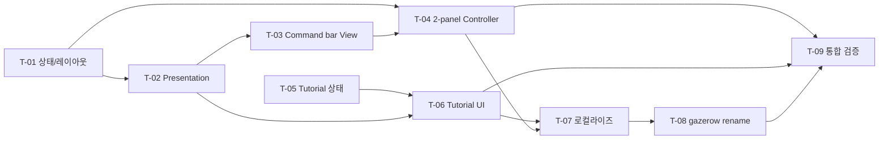

# gazerow UI/UX Develop Direction v6

## 0. 문서 성격과 구현 지시

이 문서는 아이디어 정리 문서가 아니라 구현 지시서다. 구현자는 별도의 제품 결정을 요청하지 않고, 아래 확정안을 기준으로 작업한다.

- 구현 명령 예시: `/build gazerow_uiux_develop_direction_v6.md`
- T-01부터 T-09까지 순서대로 구현한다.
- 각 작업에서 함수 또는 메서드를 추가/수정하면 같은 작업 안에서 테스트를 작성한다.
- 기존 라벨 선택, 요소 검색, 창 전환, 위험 클릭 2차 확인 기능은 변경하지 않는다.
- 이 문서에 없는 대규모 리팩토링, 패키지 rename, 저장 경로 migration은 하지 않는다.
- 작업 완료 시 해당 체크박스와 구현 기록을 갱신한다.
- 새 코드의 문서 주석 작성자는 반드시 `suho.do`다.

## 1. 변경 이력

| 버전 | 날짜 | 내용 |
| --- | --- | --- |
| v1-v5 | 2026-07-13 이전 | `/Users/suho/Downloads/gazerow_uiux_analysis_v5.md` 기반 UI/UX 분석 |
| v6 초안 | 2026-07-13 | 화면 하단 컨트롤, 키 안내, 입력 변환 안내, 이름 변경 검토 |
| v6 상세 | 2026-07-13 | 패널 구조, 상태 모델, 테스트, 작업 순서 상세화 |
| v6 확정 | 2026-07-13 | `gazerow`, 최초 튜토리얼, 한글 변환 무표시, `/`·`;` 유지, 창 후보 6개, dark HUD 확정 |

## 2. 최종 제품 결정

아래 항목은 사용자 확인을 마친 최종 결정이다.

| ID | 항목 | 최종 결정 | 변경 가능 여부 |
| --- | --- | --- | --- |
| PD-01 | 사용자 표시 이름 | `gazerow` | v6에서 고정 |
| PD-02 | 최초 사용 안내 | Onboarding 내부 3단계 모의 튜토리얼 | 고정 |
| PD-03 | 한글 라벨 입력 | 물리 키 기준 자동 변환, UI 안내 없음 | 고정 |
| PD-04 | 요소 검색 키 | `/` 유지 | 고정 |
| PD-05 | 창 전환 키 | `;` 유지 | 고정 |
| PD-06 | primer 노출 | 빈 상태에서 `/ 요소 검색`, `; 창 전환`을 항상 표시 | 고정 |
| PD-07 | 창 검색 후보 | 명령 바 위에 최대 6개 | 고정 |
| PD-08 | 명령 바 스타일 | black translucent dark HUD | 고정 |
| PD-09 | 명령 바 위치 | 대상 화면 `visibleFrame` 하단 중앙 | 고정 |
| PD-10 | 패널 구조 | target panel + command bar panel의 2-panel | 고정 |

제품명 대소문자는 `gazerow`가 정확한 표기다. 문장 시작, 메뉴바, Settings, README 제목에서도 임의로 `gazerow`로 바꾸지 않는다.

## 3. 개요

- **목적**: 오버레이 사용자가 현재 모드, 입력 상태, 다음 동작 키를 즉시 이해하도록 조작 표면을 재구성한다.
- **대상 사용자**: macOS 키보드 중심 사용자. 영문 및 한글 입력기 사용자를 모두 포함한다.
- **핵심 문제**: 대상 창 내부에 붙은 상태 UI, `/`와 `;` 발견성 부족, 첫 사용 학습 경로 부재, `gazerow` 이름의 시선 추적 오해.
- **작성일**: 2026-07-13
- **작성자**: suho.do
- **상태**: 구현중

### 3.1 성공 기준

1. 대상 창의 위치와 크기에 관계없이 명령 바가 대상 화면 하단 중앙에 표시된다.
2. 명령 바가 Dock, 메뉴바, 다른 화면 좌표와 충돌하지 않는다.
3. 라벨, 요소 검색, 창 전환, 위험 확인 상태별로 필요한 키만 보인다.
4. `/ 요소 검색`, `; 창 전환`은 오버레이 빈 상태에서 항상 보인다.
5. 신규 사용자는 실제 클릭 없이 튜토리얼에서 핵심 조작을 연습한다.
6. 한글 입력 상태에서 라벨 키가 기존처럼 자동 동작하며 변환 문구는 표시되지 않는다.
7. 창 검색 결과는 최대 6개가 명령 바 위에 표시된다.
8. 사용자 노출 이름은 `gazerow`이며 내부 호환 식별자는 `GazeRow`를 유지한다.
9. 기존 클릭, 검색, 창 전환, 위험 동작 확인 테스트가 모두 통과한다.

## 4. 범위

### 4.1 Must Have

- [ ] 대상 창 라벨 panel과 화면 하단 command bar panel을 분리한다.
- [ ] 대상 화면 선택과 command bar frame 계산을 순수 모델로 구현한다.
- [ ] 상태별 command bar presentation과 key hint를 구현한다.
- [ ] `/`, `;` primer를 빈 상태에 항상 표시한다.
- [ ] window match preview를 command bar panel로 이동한다.
- [ ] 신규 사용자를 위한 3단계 모의 튜토리얼을 추가한다.
- [ ] Settings에서 튜토리얼을 다시 열 수 있게 한다.
- [ ] 한글 물리 키 변환은 기존 자동 동작만 유지하고 UI에는 노출하지 않는다.
- [ ] 사용자 표시 이름을 `gazerow`로 변경한다.
- [ ] 한국어/영어 문구와 README를 갱신한다.
- [ ] 자동 테스트와 필수 수동 검증을 완료한다.

### 4.2 Nice to Have

Must Have 완료 후 별도 작업으로만 진행한다.

- [ ] command bar 상단/하단 위치 선택 설정.
- [ ] `/`, `;` 사용자 키맵 변경.
- [ ] command bar 마우스 인터랙션.
- [ ] window preview 개수 설정.
- [ ] `gazerow` 신규 앱 아이콘 제작.
- [ ] 튜토리얼 애니메이션 고도화.

### 4.3 제외 범위

- Swift executable target/module 이름 `GazeRow` 변경.
- `Sources/GazeRow`, `Tests/GazeRowTests` 디렉터리 rename.
- bundle identifier, signing identity, entitlements 변경.
- `GazeRow.*` 또는 기존 UserDefaults key migration.
- Application Support, 로그, 캘리브레이션 저장 경로 변경.
- gaze/camera 기능 제거 또는 구조 변경.
- `/`, `;`, `Return`, `Tab`, `Esc`, `Delete` 입력 정책 변경.
- 한글 변환 결과를 toast, chip, helper text로 표시하는 기능.
- 실제 외부 앱을 조작하는 튜토리얼.
- 클릭 자동 실행 또는 위험도 정책 변경.
- 새 외부 패키지나 snapshot test library 추가.

## 5. 현재 구현 기준선

| 영역 | 파일 | 현재 상태 | v6 변경 |
| --- | --- | --- | --- |
| target UI | `Sources/GazeRow/Overlay/OverlayView.swift` | 라벨, 상태 바, window preview가 한 View | 라벨/marker만 유지 |
| 상태 모델 | `Sources/GazeRow/Overlay/OverlayModels.swift` | `OverlayInteractionStatus`, target 기준 presentation | command bar phase/presentation 추가 |
| panel | `Sources/GazeRow/Overlay/OverlayWindowController.swift` | target frame 크기의 단일 panel | target/command 두 panel 관리 |
| 입력 | `Sources/GazeRow/Focus/FocusKeyboardCommand.swift` | ASCII 및 한글 물리 키 매핑 | 동작 변경 없음 |
| session | `Sources/GazeRow/Runtime/OverlaySessionController.swift` | 검색/클릭/창 전환과 status 생성 | 명시적 phase와 위험 상태 전달 |
| onboarding | `Sources/GazeRow/UI/OnboardingView.swift` | 설명과 setup 단계만 있는 단일 화면 | intro + 3단계 tutorial flow |
| onboarding state | `Sources/GazeRow/Infrastructure/OnboardingState.swift` | bool 완료 상태 | tutorial step/version/replay 지원 |
| settings | `Sources/GazeRow/UI/SettingsView.swift` | 사용 방법 텍스트 | 튜토리얼 다시 보기 진입점 추가 |
| 문구 | `Sources/GazeRow/Infrastructure/AppContent.swift` | 한국어/영어 안내 | command bar/tutorial 문구 SSOT 추가 |
| 이름 | `Sources/GazeRow/Infrastructure/AppState.swift` 등 | `gazerow` 노출 | 사용자 표시 이름 `gazerow` |

### 5.1 반드시 보존할 입력 동작

- ASCII letter는 실제 문자 기준으로 라벨 입력한다.
- Dvorak 등 영문 비 QWERTY 배열을 keyCode 기준으로 강제 변환하지 않는다.
- 한글 등 비 ASCII letter은 ANSI keyCode 매핑이 있으면 QWERTY 라벨로 자동 변환한다.
- 한글 자동 변환은 결과나 설명을 UI에 표시하지 않는다.
- pinned element/window scope나 진행 중 query에서는 입력 문자를 query로 사용한다.
- `/`는 `.pinScope(.elements)`다.
- `;`는 `.pinScope(.windows)`다.
- `Return`은 label/element에서 클릭, window에서 창 활성화다.
- 위험 클릭은 3초 안에 두 번째 `Return`이 필요하다.
- 클릭 성공 후 overlay를 닫고 scan cache를 무효화한다.
- 창 활성화 성공 후 frontmost window를 다시 scan한다.

## 6. 화면 구조

```text
┌──────────────────────── target screen visibleFrame ─────────────────────────┐
│                                                                             │
│          ┌──────────── target window ─────────────┐                         │
│          │  [A] 버튼      [S] 입력칸              │ <- targetPanel          │
│          │             [D] 메뉴                   │                         │
│          └────────────────────────────────────────┘                         │
│                                                                             │
│           [window 1] [window 2] [window 3] ... [window 6]                   │
│      ┌────────────────── command bar ────────────────────┐                  │
│      │ 라벨 │ 선택 상태/대상         │ 키 힌트            │                  │
│      │      │ 안내 또는 위험/실패 메시지                  │                  │
│      └────────────────────────────────────────────────────┘                  │
│                            16pt                                             │
└─────────────────────────────────────────────────────────────────────────────┘
```

### 6.1 Panel 책임

#### targetPanel

- frame: target window의 AppKit 변환 frame.
- content: boundary, target marker, label.
- target local 좌표계를 유지한다.
- command bar와 window preview를 포함하지 않는다.

#### commandBarPanel

- frame: 선택된 screen의 `visibleFrame` 하단에 계산한 command surface frame.
- content: command bar와 window preview.
- target window의 `localBounds`를 참조하지 않는다.
- preview가 없으면 투명 preview 공간을 남기지 않는다.

#### 공통 속성

- `styleMask = [.borderless]`
- `level = .statusBar`
- transparent, non-opaque, no shadow
- `ignoresMouseEvents = true`
- `hidesOnDeactivate = false`
- `collectionBehavior = [.canJoinAllSpaces, .fullScreenAuxiliary]`
- keyboard event tap은 두 panel이 공유하는 하나만 사용

### 6.2 Command bar 수치

| 항목 | 값 |
| --- | --- |
| 권장 너비 | `680pt` |
| 최소 너비 | `360pt` |
| 좌우 화면 여백 | `16pt` |
| 화면 하단 여백 | `16pt` |
| compact 높이 | `72pt` |
| message 포함 높이 | `88pt` |
| window preview 영역 | `88pt` |
| 내부 가로 padding | `14pt` |
| 내부 세로 padding | `10pt` |
| 영역 간격 | `12pt` |
| corner radius | `8pt` |
| mode 영역 최소 너비 | `76pt` |
| keycap 높이 | `24pt` |
| keycap 가로 padding | `7pt` |

계산식:

```text
availableWidth = max(0, visibleFrame.width - 32)
barWidth = min(680, availableWidth)
barX = visibleFrame.midX - barWidth / 2
barY = visibleFrame.minY + 16
```

- `visibleFrame.width < 392`면 bar를 2행 compact layout으로 바꾼다.
- 극단적으로 좁은 화면에서는 좌우 여백을 최소 `8pt`까지 줄일 수 있다.
- preview가 생기면 bar의 y는 유지하고 panel이 위쪽으로만 확장된다.
- Retina scale에 별도 pixel 보정을 하지 않고 AppKit point 좌표를 사용한다.

### 6.3 대상 화면 선택

1. AX target frame을 `OverlayScreenFrameMapper`로 AppKit frame으로 변환한다.
2. 각 screen frame과 target frame의 intersection area를 계산한다.
3. 교차 면적이 가장 큰 screen을 선택한다.
4. 동률이면 target center를 포함하는 screen을 선택한다.
5. 그래도 결정되지 않으면 main screen을 선택한다.
6. screen 목록이 비어 있으면 target frame을 fallback visibleFrame으로 사용하고 crash하지 않는다.

`first(where: intersects)` 방식은 사용하지 않는다. 두 화면 경계에 걸친 창이 작은 교차 영역 쪽 화면을 잘못 선택할 수 있다.

## 7. Command bar UX

### 7.1 시각 스타일

- 기본 배경: black, opacity `0.82`.
- 테두리: white opacity `0.22`, 1pt.
- shadow: panel shadow는 끄되 SwiftUI content에 약한 black shadow를 허용한다.
- labels mode: orange accent.
- elements mode: cyan accent.
- windows mode: blue accent.
- warning: orange.
- failure: red text/icon만 사용하고 전체 배경을 red로 바꾸지 않는다.
- success: green text/icon만 사용한다.
- 내부에 중첩 card를 만들지 않는다.
- keycap 크기를 고정해 문구 변화로 bar 높이가 움직이지 않게 한다.
- Reduce Motion 사용 시 opacity transition만 적용한다.

### 7.2 정보 계층

1. 좌측: 현재 mode 하나.
2. 중앙 상단: buffer, focused target, match index/count.
3. 우측: 현재 상태의 key hint.
4. 중앙 하단: helper, warning, failure message.

View에서 상태 문자열을 직접 조합하지 않는다. 순수 presentation 모델이 최종 표시 값을 만든다.

### 7.3 명시적 상태 모델

```swift
enum OverlayInteractionPhase: Equatable {
    case idle
    case typing
    case matching
    case noMatches
    case awaitingRiskConfirmation
    case success
    case failure
}
```

`OverlayInteractionStatus` 추가 필드:

```swift
let phase: OverlayInteractionPhase
let requiresSecondConfirm: Bool
```

- 기본값은 `.idle`, `false`다.
- UI가 `message` 문자열을 파싱해 phase를 추론하면 안 된다.
- 위험 클릭 대기는 `.awaitingRiskConfirmation`, `requiresSecondConfirm = true`다.
- 기존 status 생성 경로는 scope, buffer, focus, match를 잃지 않도록 `status(for:...)` helper를 사용한다.

### 7.4 Presentation 모델

```swift
struct OverlayCommandBarPresentation: Equatable {
    let modeTitle: String
    let inputText: String
    let summaryText: String
    let keyHints: [OverlayKeyHint]
    let helperText: String?
    let tone: OverlayInteractionStatus.Tone
}

struct OverlayKeyHint: Equatable, Identifiable {
    let key: String
    let action: String
    let priority: Int

    var id: String { "\(key):\(action)" }
}
```

- `OverlayCommandBarPresentation.init(status:content:)`에서 모든 분기를 처리한다.
- key hint는 priority 순으로 최대 5개만 노출한다.
- SwiftUI View는 presentation 값을 표시만 한다.
- 위험 확인은 일반 helper보다 우선한다.
- failure는 일반 helper보다 우선한다.

### 7.5 상태별 문구와 키

| 상태 | mode | 중앙 요약 | key hint 우선순위 | helper |
| --- | --- | --- | --- | --- |
| 첫 idle | 라벨 | `라벨 키를 입력하세요` | `A-Z 선택`, `/ 요소 검색`, `; 창 전환`, `Esc 닫기` | `라벨 입력 후 Return으로 클릭` |
| 라벨 입력 | 라벨 | `{BUFFER} 입력 중` | `Return 클릭`, `Delete 지우기`, `Tab 다음`, `Esc 닫기` | focused target 이름 |
| 라벨 일치 | 라벨 | `{LABEL} · {TARGET}` | `Return 클릭`, `Tab 다음`, `Shift+Tab 이전`, `Esc 닫기` | 없음 |
| 라벨 불일치 | 라벨 | `일치하는 라벨 없음` | `Delete 지우기`, `/ 요소 검색`, `; 창 전환`, `Esc 닫기` | buffer |
| 요소 빈 query | 요소 검색 | `검색어를 입력하세요` | `문자 검색`, `; 창 전환`, `Delete 초기화`, `Esc 닫기` | `/ 요소 검색 모드` |
| 요소 결과 | 요소 검색 | `{INDEX}/{COUNT} · {TARGET}` | `Tab 다음`, `Shift+Tab 이전`, `Return 클릭`, `Delete 지우기`, `Esc 닫기` | query |
| 요소 결과 없음 | 요소 검색 | `검색 결과 없음` | `Delete 지우기`, `; 창 전환`, `Esc 닫기` | query |
| 창 빈 query | 창 전환 | `앱 또는 창 이름을 입력하세요` | `문자 검색`, `/ 요소 검색`, `Delete 초기화`, `Esc 닫기` | `; 창 전환 모드` |
| 창 결과 | 창 전환 | `{INDEX}/{COUNT} · {WINDOW}` | `Tab 다음`, `Shift+Tab 이전`, `Return 전환`, `Delete 지우기`, `Esc 닫기` | query + preview 최대 6개 |
| 창 결과 없음 | 창 전환 | `일치하는 창 없음` | `Delete 지우기`, `/ 요소 검색`, `Esc 닫기` | query |
| 위험 확인 | 현재 mode | `위험 동작입니다` | `Return 다시 확인`, `Esc 취소` | 기존 risk guidance |
| 실패 | 현재 mode | 기존 context 유지 | `Return 다시 시도`, `Esc 닫기` | failure message |

### 7.6 키 표기

- `Return`, `Tab`, `Shift+Tab`, `Delete`, `Esc`, `/`, `;`, `A-Z`로 통일한다.
- 사용자에게 `dryRunConfirm`, `pinScope`, `labels`, `elements`, `windows`를 노출하지 않는다.
- 한국어 동사는 `선택`, `클릭`, `전환`, `다음`, `이전`, `지우기`, `닫기`를 사용한다.
- 영어 동사는 `Select`, `Click`, `Switch`, `Next`, `Previous`, `Clear`, `Close`를 사용한다.
- `Enter`와 `Return`을 섞지 않고 `Return`만 표시한다.
- `/`, `;`는 일반 텍스트보다 keycap 대비를 높인다.
- 빈 상태에서 `/`, `;`는 다른 보조 키보다 먼저 숨기지 않는다.

## 8. 최초 튜토리얼

### 8.1 원칙

- 기존 `OnboardingView` 안에 포함한다.
- 실제 Accessibility scan, ClickExecutor, WindowActivator를 호출하지 않는다.
- 외부 앱에 label overlay를 띄우지 않는다.
- 모의 target과 모의 command bar를 사용한다.
- 실제 `FocusKeyboardCommandMapper`를 재사용해 키 해석은 제품과 일치시킨다.
- 한글 입력도 자동 동작하지만 `ㄹ -> F` 같은 변환 결과는 표시하지 않는다.
- `건너뛰기`, `이전`, `다음`, `완료`를 제공한다.
- Settings에서 언제든 `튜토리얼 다시 보기`가 가능하다.

### 8.2 Onboarding 전체 흐름

```mermaid
stateDiagram-v2
    [*] --> Intro: 첫 실행
    Intro --> LabelPractice: 시작하기
    LabelPractice --> ModePractice: 라벨 선택 성공
    ModePractice --> Finish: / 와 ; 확인
    Intro --> Finish: 건너뛰기
    LabelPractice --> Finish: 건너뛰기
    ModePractice --> Finish: 건너뛰기
    Finish --> [*]: 완료 저장
```



Onboarding page:

| page | 목적 | 완료 조건 |
| --- | --- | --- |
| intro | 권한 범위, 단축키, 안전성 설명 | `시작하기` 선택 |
| labelPractice | 라벨 입력 후 Return 클릭 흐름 연습 | 지정 라벨 입력 + Return |
| modePractice | `/` 요소 검색과 `;` 창 전환 발견성 학습 | 두 primer를 각각 한 번 입력 |
| finish | 핵심 키 요약과 다시 보기 위치 안내 | `완료` 선택 |

### 8.3 Intro

표시 내용:

- 제품명 `gazerow`.
- 한 줄 설명: `키보드로 화면 요소를 선택하고 클릭합니다.`
- global shortcut: `Command + Shift + Space` keycap.
- Accessibility 접근 범위와 기존 non-medical disclaimer.
- `실제 클릭은 항상 Return 확인 후 실행됩니다.`

버튼:

- primary: `시작하기`
- secondary: `건너뛰기`

`시작하기`는 tutorial step 1로 이동한다. `건너뛰기`는 onboarding과 tutorial version을 완료 처리하고 닫는다.

### 8.4 Step 1: 라벨 선택 연습

모의 화면:

```text
┌──────────── 연습 화면 ────────────┐
│ [A] 열기   [F] 저장   [J] 취소    │
└────────────────────────────────────┘

┌──────────── 모의 command bar ─────┐
│ 라벨 │ F를 입력하세요 │ Esc 닫기  │
└────────────────────────────────────┘
```

상호작용:

1. 사용자가 물리 `F` 위치 키를 누른다.
2. 영어 입력이면 `F`, 한글 입력이면 해당 keyCode가 자동으로 `F` 라벨에 매칭된다.
3. `저장` 모의 control만 focus style로 강조한다.
4. command bar를 `Return으로 선택` 상태로 바꾼다.
5. 사용자가 `Return`을 누르면 성공 check와 함께 Step 2로 이동한다.

제약:

- 실제 저장 동작을 실행하지 않는다.
- 다른 라벨 입력 시 해당 모의 control을 focus할 수 있지만 Step 완료는 `F` + `Return`만 허용한다.
- 잘못된 키는 실패 alert를 띄우지 않고 `F 라벨을 선택해 보세요` helper만 갱신한다.
- `Esc`는 onboarding 전체를 닫지 않고 `건너뛰기/종료` 확인을 표시한다.

### 8.5 Step 2: 요소 검색과 창 전환 연습

한 화면에서 두 primer를 순서대로 확인한다.

초기 표시:

```text
┌──────────────── command bar ────────────────┐
│ 라벨 │ / 요소 검색 │ ; 창 전환 │ Esc 닫기  │
└──────────────────────────────────────────────┘
```

첫 번째 과제:

1. `/` keycap을 pulse가 아닌 border/accent로 강조한다.
2. 사용자가 `/`를 누르면 mode가 `요소 검색`으로 바뀐다.
3. 모의 query `저장`과 결과 `1/2 · 저장 버튼`을 자동 예시로 보여준다.
4. `/ 요소 검색 확인` 상태를 기록한다.

두 번째 과제:

1. `;` keycap을 강조한다.
2. 사용자가 `;`를 누르면 mode가 `창 전환`으로 바뀐다.
3. 모의 window preview 3개와 `1/3 · Safari`를 보여준다.
4. `; 창 전환 확인` 상태를 기록하고 Finish로 이동한다.

사용자가 `;`를 먼저 눌러도 정상 인정한다. 완료 조건은 순서와 관계없이 `/`, `;`를 각각 한 번 입력하는 것이다.

### 8.6 Finish

표시할 최종 요약:

| 키 | 동작 |
| --- | --- |
| `A-Z` | 라벨 선택 |
| `/` | 요소 검색 |
| `;` | 창 전환 |
| `Tab` / `Shift+Tab` | 다음/이전 후보 |
| `Return` | 클릭 또는 창 전환 확인 |
| `Esc` | 닫기 |

문구:

```text
준비가 끝났습니다.
Settings > 사용 방법에서 언제든 튜토리얼을 다시 볼 수 있습니다.
```

버튼:

- primary: `gazerow 시작`
- secondary: `이전`

### 8.7 Tutorial 상태 모델

```swift
enum TutorialStep: Int, Equatable, CaseIterable {
    case intro
    case labelPractice
    case modePractice
    case finish
}

struct TutorialProgress: Equatable {
    var step: TutorialStep
    var focusedDemoLabel: Character?
    var didConfirmDemoLabel: Bool
    var didTryElementSearch: Bool
    var didTryWindowSwitch: Bool
}
```

`OnboardingState` 확장:

```swift
static let currentTutorialVersion = 1

var tutorialStep: TutorialStep
var isTutorialReplay: Bool
var hasCompletedCurrentTutorial: Bool

func startTutorial()
func replayTutorial()
func moveToPreviousTutorialStep()
func handleTutorialCommand(_ command: FocusKeyboardCommand)
func completeTutorial()
func skipTutorial()
```

저장 키:

```text
onboarding.completed                 # 기존 key 유지
onboarding.tutorialVersion           # Int, 신규
```

- 신규 사용자가 Finish 또는 Skip을 선택하면 `onboarding.completed = true`, tutorial version `1`을 저장한다.
- 기존 사용자가 `onboarding.completed = true`, tutorial version `0`이어도 강제로 onboarding을 다시 띄우지 않는다.
- 기존 사용자는 Settings의 다시 보기 버튼으로 tutorial을 실행한다.
- replay 완료/중단은 기존 onboarding 완료 상태를 false로 바꾸지 않는다.
- 테스트는 격리된 UserDefaults suite를 사용한다.

### 8.8 Tutorial 입력 reducer

Tutorial View에서 key별 분기를 직접 만들지 않는다.

```swift
struct TutorialInputReducer {
    mutating func reduce(
        progress: TutorialProgress,
        command: FocusKeyboardCommand
    ) -> TutorialProgress
}
```

- raw NSEvent를 `FocusKeyboardInput`으로 만든다.
- `FocusKeyboardCommandMapper`로 command를 만든다.
- mapper가 nil을 반환하면 tutorial state를 변경하지 않는다.
- tutorial reducer는 `.typeLabel`, `.pinScope`, `.dryRunConfirm`, `.closeOverlay`만 처리한다.
- query append, click execution, window activation은 호출하지 않는다.
- 복잡도가 높아지면 step별 private reducer로 분리한다.

## 9. 한글 입력 정책

한글 입력은 기존 자동 매핑을 그대로 유지하고 사용자 UI에는 변환 사실을 표시하지 않는다.

### 9.1 동작

- 한글 `ㄹ`이 keyCode 3이면 라벨 `F`로 동작한다.
- 한글 `ㅁ`이 keyCode 0이면 라벨 `A`로 동작한다.
- 한글 `ㅓ`가 keyCode 38이면 라벨 `J`로 동작한다.
- element/window query에서는 한글 문자열을 그대로 검색한다.
- characters가 nil/empty이고 keyCode만 있으면 기존 physical letter fallback을 유지한다.

### 9.2 UI 금지 사항

- `ㄹ -> F` toast를 표시하지 않는다.
- 변환 chip, helper, tutorial 설명을 표시하지 않는다.
- 변환 횟수 UserDefaults를 추가하지 않는다.
- 변환 timer/scheduler를 추가하지 않는다.
- Settings에 한글 변환표를 추가하지 않는다.

튜토리얼과 Settings에는 다음 정도만 허용한다.

```text
한국어 입력 상태에서도 라벨 키를 그대로 사용할 수 있습니다.
```

구체적인 문자 변환 결과는 보여주지 않는다.

## 10. Window preview

- windows scope이고 검색 결과가 있을 때만 표시한다.
- 최대 6개를 command bar 바로 위에 표시한다.
- 현재 선택을 중심으로 기존 `windowMatchPreviewIndices` 정책을 유지한다.
- 선택된 preview는 blue border와 더 높은 opacity를 사용한다.
- app icon, app name, window detail을 표시한다.
- 긴 이름은 한 줄 tail truncation한다.
- icon이 없으면 기존 placeholder를 사용한다.
- preview card corner radius는 8pt 이하로 한다.
- preview가 생기거나 사라져도 command bar y는 고정한다.
- `Tab`, `Shift+Tab`으로 focus가 이동할 때 layout 크기가 변하지 않는다.

## 11. 로컬라이즈 문구

현재 `OverlayStatusView`의 `AppContent.localized(for: .english)` hardcode를 제거한다. 현재 `AppLanguageSettings().selectedLanguage`를 controller 또는 presentation 생성 지점에 주입한다.

### 11.1 Command bar 문구

| 의미 | 한국어 | 영어 |
| --- | --- | --- |
| label mode | 라벨 | Labels |
| element mode | 요소 검색 | Element Search |
| window mode | 창 전환 | Window Switcher |
| label idle | 라벨 키를 입력하세요 | Type a label key |
| element idle | 검색어를 입력하세요 | Type to search elements |
| window idle | 앱 또는 창 이름을 입력하세요 | Type an app or window name |
| label no match | 일치하는 라벨 없음 | No matching label |
| element no match | 검색 결과 없음 | No element matches |
| window no match | 일치하는 창 없음 | No window matches |
| first helper | 라벨 입력 후 Return으로 클릭 | Type a label, then press Return to click |
| risk title | 위험 동작입니다 | Risky action |
| confirm again | 다시 확인 | Confirm again |

### 11.2 Tutorial 문구

`AppContent.Localized`에 다음 의미의 필드를 추가한다.

- tutorial title/subtitle
- start, skip, previous, next, finish button
- label practice title/instruction/success/helper
- mode practice title/instruction
- element primer confirmed
- window primer confirmed
- finish title/detail
- replay tutorial button
- tutorial exit confirmation

View에서 한국어/영어 삼항 연산으로 문구를 만들지 않는다.

### 11.3 Settings 사용 방법

기존 `overlayUsageSteps`를 다음 순서로 정리한다.

1. `Command+Shift+Space`로 오버레이 열기.
2. 라벨 키 입력 후 `Return`으로 클릭.
3. `/`로 요소 검색.
4. `;`로 창 전환.
5. `Tab`/`Shift+Tab`으로 후보 이동.
6. `Esc`로 닫기.

사용 방법 section에 `튜토리얼 다시 보기` 버튼을 추가한다.

## 12. 제품 이름 변경

### 12.1 최종 이름

사용자 표시 이름은 정확히 `gazerow`다.

한 줄 설명:

```text
한국어: 키보드로 화면 요소를 선택하고 클릭하는 macOS 유틸리티
English: A macOS utility for selecting and clicking interface elements from the keyboard
```

### 12.2 변경 대상

- `Sources/GazeRow/Infrastructure/AppState.swift`의 `appName`.
- README/README.en 제목과 첫 설명.
- Settings와 Onboarding 헤더.
- 메뉴바 Enable/Disable, 후원, 권한, 시작 실패 안내.
- gaze/camera 권한 안내의 사용자 노출 제품명.
- `AppIconConfiguration` accessibility description.
- build/package script가 생성하는 `.app` 표시 이름과 `CFBundleDisplayName`.
- 최신 decisions 문서의 제품 이름 결정.

### 12.3 유지 대상

- `Package.swift`의 executable target/module `GazeRow`.
- source/test 내부 모듈 이름과 경로는 `GazeRow`를 유지.
- source/test 디렉터리.
- `import GazeRow`, `@testable import GazeRow`.
- bundle identifier, entitlements.
- UserDefaults key와 저장 디렉터리.
- 역사적 계획 문서의 과거 기록.

### 12.4 호환성

- bundle/signing identity가 바뀌지 않게 한다.
- 기존 Accessibility 권한 유지 여부를 수동 확인한다.
- `.app` 디렉터리만 `gazerow.app`으로 바꾸는 경우 내부 executable lookup을 검증한다.
- 기존 `GazeRow.app`과 새 `gazerow.app`이 동시에 남는 update 상황을 배포 문서에 기록한다.
- 향후 이름 변경은 `AppState.appName`을 기준으로 최소 변경할 수 있게 사용자 문구의 literal을 줄인다.

## 13. 기술 구조

### 13.1 권장 파일 구조

```text
Sources/GazeRow/Overlay/
├── OverlayView.swift
├── OverlayCommandBarView.swift
├── OverlayWindowMatchStripView.swift
├── OverlayModels.swift
└── OverlayCommandBarModels.swift

Sources/GazeRow/UI/
├── OnboardingView.swift
├── TutorialPracticeView.swift
└── SettingsView.swift
```

필요하면 tutorial 순수 reducer는 `Infrastructure/TutorialInputReducer.swift`에 둔다. View 파일 안에 비즈니스 상태 전이를 몰아넣지 않는다.

### 13.2 Screen/layout 타입

```swift
struct OverlayScreenDescriptor: Equatable {
    let frame: CGRect
    let visibleFrame: CGRect
    let scaleFactor: CGFloat
}

struct OverlayCommandBarLayout: Equatable {
    let panelFrame: CGRect
    let commandBarFrame: CGRect
    let previewFrame: CGRect?
}

struct OverlayCommandBarLayoutEngine {
    func makeLayout(
        visibleFrame: CGRect,
        showsWindowPreviews: Bool,
        showsMessage: Bool
    ) -> OverlayCommandBarLayout
}
```

- descriptor는 AppKit 좌표다.
- frame 계산은 AppKit panel 없이 테스트 가능해야 한다.
- screen provider는 테스트에서 descriptor 배열을 주입할 수 있어야 한다.

### 13.3 Controller 필드

```swift
private var targetPanel: OverlayPanel?
private var commandBarPanel: OverlayPanel?
```

Lifecycle:

- `show` 시작 시 기존 두 panel과 event tap을 정리한다.
- target panel과 command panel content를 모두 설정한 뒤 order front한다.
- `isVisible`은 두 panel이 모두 visible일 때 true다.
- `persistsWhileAppInactive`는 두 panel이 모두 `hidesOnDeactivate == false`일 때 true다.
- `updateFocus`는 target marker와 command bar summary를 갱신한다.
- `updateStatus`는 command bar와 필요한 target focus를 갱신한다.
- `close`는 event tap을 한 번 stop하고 두 panel을 모두 닫는다.
- event tap 실패 fallback에서는 기존 target panel이 key input을 받게 한다.
- panel 하나만 남는 상태를 허용하지 않는다.

## 14. 작업 목록

### T-01 상태와 layout 순수 모델

- [x] `OverlayInteractionPhase`와 status 필드를 추가한다.
- [x] screen descriptor와 command bar layout engine을 추가한다.
- [x] desktop, narrow, preview on/off, message on/off, negative-origin frame을 테스트한다.

완료 기준:

- bar y가 항상 `visibleFrame.minY + 16`이다.
- preview/message 변화가 bar y를 바꾸지 않는다.
- screen 밖으로 나가지 않는다.

### T-02 Command bar presentation

- [x] `OverlayCommandBarPresentation`, `OverlayKeyHint`를 추가한다.
- [x] 상태 표 전체를 presentation으로 구현한다.
- [x] key hint priority와 최대 5개 제한을 구현한다.
- [x] 한국어/영어 presentation 테스트를 작성한다.

완료 기준:

- label idle에서 `/`, `;`가 모두 보인다.
- windows 결과에서 Return 동사는 전환이다.
- no-match에서 실행 불가능한 Return을 표시하지 않는다.
- 위험 확인에는 Return 다시 확인과 Esc가 우선한다.

### T-03 Command bar View와 preview 분리

- [x] `OverlayCommandBarView`를 구현한다.
- [x] `WindowMatchStripView`를 별도 파일로 옮긴다.
- [x] `OverlayView`에서 status/preview를 제거한다.
- [x] dark HUD와 mode별 accent를 구현한다.
- [x] narrow layout과 text truncation을 구현한다.

완료 기준:

- target View는 command bar 위치 계산을 하지 않는다.
- window preview는 command bar panel root에서만 렌더링된다.
- 동적 문구가 key hint를 가리지 않는다.

### T-04 2-panel WindowController

- [x] 단일 panel을 target/command 두 panel로 분리한다.
- [x] 교차 면적 기준 screen 선택을 구현한다.
- [x] 두 panel의 show/update/close lifecycle을 동기화한다.
- [x] event tap 하나와 fallback 동작을 유지한다.
- [x] controller 테스트를 확장한다.

완료 기준:

- show 후 두 panel 모두 visible이다.
- close 후 두 panel 모두 hidden이다.
- event tap start/stop은 각각 한 번이다.
- 다중 모니터에서 올바른 화면을 선택한다.

### T-05 Tutorial 상태와 reducer

- [x] `TutorialStep`, `TutorialProgress`, `TutorialInputReducer`를 추가한다.
- [x] `OnboardingState`에 version/replay/step 전이를 추가한다.
- [x] 기존 완료 key를 유지한다.
- [x] 신규/기존/replay/skip 상태 테스트를 작성한다.
- [x] tutorial mapper 경로에서 한글 물리 키 입력 테스트를 작성한다.

완료 기준:

- 신규 사용자는 tutorial을 완료/skip할 수 있다.
- 기존 사용자는 강제 onboarding 없이 replay할 수 있다.
- reducer는 실제 click/window activation을 호출하지 않는다.
- 한글 입력에서도 demo F label이 자동 선택되며 변환 문구가 없다.

### T-06 Tutorial UI

- [x] Onboarding을 intro/tutorial/finish flow로 확장한다.
- [x] label practice 모의 화면을 구현한다.
- [x] `/`, `;` mode practice를 구현한다.
- [x] back/skip/finish와 exit confirmation을 구현한다.
- [x] Settings에 replay 버튼을 추가한다.
- [x] keyboard focus와 VoiceOver label을 구현한다.

완료 기준:

- 실제 외부 앱 UI에 영향을 주지 않는다.
- 마우스 없이 tutorial 완료가 가능하다.
- `/`, `;`를 각각 입력해야 mode practice가 완료된다.
- replay 중단이 기존 onboarding 완료 상태를 손상하지 않는다.

### T-07 로컬라이즈와 사용 방법

- [x] command bar/tutorial 문구를 `AppContent.Localized`에 추가한다.
- [x] overlay의 `.english` hardcode를 제거한다.
- [x] Settings 사용 방법을 확정된 키 정책으로 갱신한다.
- [x] AppContent 한국어/영어 테스트를 추가한다.

완료 기준:

- 한국어 설정에서는 command bar/tutorial이 한국어다.
- 영어 설정에서는 command bar/tutorial이 영어다.
- 두 언어 모두 key 이름 표기가 같다.

### T-08 `gazerow` 표시 이름 적용

- [x] `AppState.appName`을 `gazerow`로 변경한다.
- [x] 사용자 노출 이름 literal을 `gazerow` 기준으로 정리한다.
- [x] README와 build/package script를 갱신한다.
- [x] 내부 식별자와 저장 key는 유지한다.
- [x] `plans/gazerow_decisions_v1.md`의 제품 이름 결정을 갱신한다.

완료 기준:

```bash
rg -n 'GazeRow|KeyCursor|keyCursor' Sources README.md README.en.md scripts
```

검색 결과의 모든 `GazeRow`는 target/module/path/internal compatibility 목적이어야 한다. 사용자 노출 구 표기는 남지 않아야 한다.

### T-09 통합 검증

- [x] `swift test`를 실행한다.
- [x] local `.app` build와 launch를 확인한다.
- [ ] 필수 수동 검증 매트릭스를 수행한다.
- [x] 발견한 제한사항을 known limitations 문서에 기록한다.
- [ ] 이 문서의 상태와 구현 기록을 완료로 갱신한다.

## 15. 테스트 명세

### 15.1 OverlayCommandBarLayoutEngineTests

- [ ] 1440x900 frame에서 680pt bar가 중앙에 배치된다.
- [ ] Dock으로 visibleFrame minY가 올라가도 minY + 16이다.
- [ ] 392pt 미만 너비에서 좌우 안전 여백을 지킨다.
- [ ] preview가 추가돼도 bar y가 유지된다.
- [ ] message가 추가돼도 bar y가 유지된다.
- [ ] 음수 x/y origin에서 visibleFrame 내부에 포함된다.

### 15.2 OverlayCommandBarPresentationTests

- [ ] label idle에서 `A-Z`, `/`, `;`, `Esc`가 보인다.
- [ ] label match에서 Return/Tab/Shift+Tab/Esc가 보인다.
- [ ] elements와 windows의 Return 동사가 다르다.
- [ ] no match에서 Return이 없다.
- [ ] 위험 확인의 key 우선순위가 맞다.
- [ ] key hint가 5개를 넘지 않는다.
- [ ] 한국어/영어 문구가 맞다.

### 15.3 OverlayWindowControllerTests

- [ ] 두 panel이 함께 열리고 닫힌다.
- [ ] 두 panel 모두 앱 비활성 상태에서 유지된다.
- [ ] event tap이 중복 생성되지 않는다.
- [ ] target 교차 면적이 큰 screen을 선택한다.
- [ ] command panel이 selected visibleFrame 안에 있다.
- [ ] updateStatus가 command panel content를 갱신한다.

### 15.4 TutorialInputReducerTests

- [ ] intro 초기 progress가 맞다.
- [ ] F label 입력 후 Return으로 label practice가 완료된다.
- [ ] 잘못된 label은 완료 처리되지 않는다.
- [ ] 한글 물리 F 위치 입력도 동일하게 완료된다.
- [ ] `/` 입력이 element practice flag를 설정한다.
- [ ] `;` 입력이 window practice flag를 설정한다.
- [ ] 순서와 관계없이 두 flag가 모두 true면 finish로 이동한다.
- [ ] 실제 click/window command side effect가 없다.

### 15.5 OnboardingStateTests

- [ ] 신규 사용자는 onboarding을 표시한다.
- [ ] 완료 시 bool과 tutorial version을 저장한다.
- [ ] skip도 version을 저장한다.
- [ ] 기존 완료 사용자는 version 0이어도 강제로 표시하지 않는다.
- [ ] replay는 onboarding 완료 값을 변경하지 않는다.
- [ ] replay 완료/중단 후 presentation 상태가 정상이다.
- [ ] 임시 UserDefaults suite를 사용한다.

### 15.6 기존 mapper 회귀 테스트

- [ ] `ㄹ` -> F, `ㅁ` -> A, `ㅓ` -> J 기존 테스트를 유지한다.
- [ ] ASCII/Dvorak 입력 보존 테스트를 유지한다.
- [ ] pinned query의 한글 입력이 query로 유지된다.
- [ ] 변환 notice/model/store가 새로 추가되지 않았음을 코드 리뷰로 확인한다.

### 15.7 이름/문구 테스트

- [ ] `AppState.appName == "gazerow"`다.
- [ ] 한국어와 영어 tutorial 문구가 모두 존재한다.
- [ ] 사용자 문구에 구 제품명 오표기가 없다.
- [ ] 내부 defaults key와 module 이름은 기존 값을 유지한다.

### 15.8 테스트 원칙

- Given-When-Then 패턴을 유지한다.
- 함수/메서드 변경과 테스트를 같은 작업에서 작성한다.
- 실제 `UserDefaults.standard`를 오염시키지 않는다.
- AppKit panel 테스트 후 `close()`한다.
- 실제 global hotkey, AX click, window activation을 tutorial 테스트에서 실행하지 않는다.
- SwiftUI screenshot dependency를 추가하지 않는다.

## 16. 수동 검증 매트릭스

| 환경 | 시나리오 | 기대 결과 | 필수 |
| --- | --- | --- | --- |
| 신규 설치 | 앱 첫 실행 | intro 뒤 tutorial 진입 가능 | 예 |
| 신규 설치 | tutorial skip | 완료 저장 후 다시 자동 표시하지 않음 | 예 |
| Settings | tutorial replay | 언제든 tutorial 재실행 가능 | 예 |
| tutorial | F + Return | 모의 저장 control 선택, 실제 side effect 없음 | 예 |
| tutorial | `/`, `;` | 두 mode를 모두 확인하고 finish 이동 | 예 |
| tutorial + 한글 IME | 물리 F 위치 입력 | 자동 선택, 변환 문구 없음 | 예 |
| 단일 모니터, Dock 하단 | overlay 실행 | Dock 위 화면 하단 중앙 | 예 |
| 단일 모니터, Dock 좌측 | overlay 실행 | visibleFrame 하단 중앙 | 예 |
| 화면 하단 target 창 | overlay 실행 | target 내부가 아닌 화면 하단 bar | 예 |
| 작은 target 창 | overlay 실행 | bar 너비가 target width와 무관 | 예 |
| 우측 외장 모니터 | 해당 창에서 실행 | 외장 화면 하단 표시 | 예 |
| 음수 origin 모니터 | 해당 창에서 실행 | 좌표 오류 없음 | 예 |
| 두 화면 경계 창 | 교차 면적 변경 | 큰 교차 면적 화면 선택 | 예 |
| label idle | overlay 실행 | `/`, `;`가 모두 명확히 보임 | 예 |
| 요소 검색 | `/` + 한글 query | query 원문 유지, 변환 문구 없음 | 예 |
| 창 검색 | `;`, 검색, Tab, Return | preview 이동 후 창 전환 | 예 |
| 창 검색 결과 7개 이상 | Tab 이동 | 최대 6개 preview, 선택 중심 갱신 | 예 |
| 위험 control | Return | 2차 확인 key만 강조 | 예 |
| 한국어 설정 | overlay/tutorial | 한국어 문구 | 예 |
| 영어 설정 | overlay/tutorial | 영어 문구 | 예 |
| full-screen Space | overlay 실행 | 두 panel이 같은 Space에 표시 | 예 |
| event tap fallback | 권한 없음 | 기존 fallback 입력 가능 | 예 |

## 17. 성능과 접근성

- overlay start부터 두 panel 표시까지 기존 대비 50ms 이상 회귀하지 않는 것을 목표로 한다.
- 키 입력마다 screen 목록을 다시 만들지 않는다. show/rescan 시 screen context를 결정한다.
- command bar 상태 갱신에서 디스크 I/O를 하지 않는다.
- 긴 target/window 이름은 tail truncation한다.
- keycap과 mode 영역의 안정된 크기로 layout shift를 방지한다.
- tutorial의 현재 step, 선택 control, 성공 상태에 VoiceOver label을 제공한다.
- 색상만으로 active mode나 성공을 표현하지 않고 텍스트/아이콘을 함께 사용한다.
- keyboard focus indicator가 dark HUD와 tutorial 배경에서 충분한 대비를 가져야 한다.
- 순환 복잡도 10, 인지 복잡도 15를 넘는 분기는 helper/reducer로 분리한다.

## 18. 예외 정책

| 상황 | 처리 |
| --- | --- |
| screen 목록 비어 있음 | target frame fallback, crash 금지 |
| visibleFrame이 매우 좁음 | 2행 layout, 좌우 최소 8pt |
| command panel 생성 실패 | target panel도 닫고 반쪽 overlay 방지 |
| preview icon 없음 | placeholder 사용 |
| tutorial 중 focus 상실 | progress 유지, 복귀 후 계속 |
| tutorial replay 중 창 닫기 | 기존 onboarding 완료 값 유지 |
| tutorial에서 알 수 없는 키 | 상태 변경 없음 |
| 언어 변경 | 다음 View render에서 최신 문구 반영 |
| 이름 변경 후 권한 문제 | bundle/signing identity 변경 여부 확인 |

## 19. 구현 금지 패턴

- target panel을 screen 전체 크기로 늘려 command bar를 함께 넣지 않는다.
- command bar 좌표를 target `localBounds`로 계산하지 않는다.
- UI가 `message.contains(...)`로 phase를 추론하지 않는다.
- `/`, `;`를 tutorial에만 보여주고 실제 idle bar에서 숨기지 않는다.
- 한글 변환 toast/chip/store/timer를 추가하지 않는다.
- 한글 query를 QWERTY 문자열로 바꾸지 않는다.
- ASCII 문자를 keyCode 기준으로 재매핑하지 않는다.
- tutorial에서 실제 AX scan/click/window activation을 호출하지 않는다.
- tutorial key handling을 View의 중첩 switch에 몰아넣지 않는다.
- 사용자 표시 이름 변경과 내부 package/module rename을 함께 하지 않는다.
- View에서 `.english`를 hardcode하지 않는다.
- 테스트를 T-09까지 미루지 않는다.

## 20. 구현 의존성



각 T 작업이 끝날 때 관련 테스트를 실행한다. 실패한 테스트를 다음 작업으로 넘기지 않는다.

## 21. Definition of Done

- [ ] T-01부터 T-09까지 완료됐다.
- [ ] `swift test`가 통과했다.
- [ ] local `.app` build와 launch가 성공했다.
- [ ] 필수 수동 검증 매트릭스가 통과했다.
- [ ] 신규 사용자가 안전한 모의 tutorial을 완료할 수 있다.
- [ ] Settings에서 tutorial replay가 가능하다.
- [ ] `/`, `;`가 idle command bar에서 항상 보인다.
- [ ] 한글 라벨 입력은 자동 동작하고 변환 UI는 없다.
- [ ] window preview는 최대 6개다.
- [ ] command bar는 target screen visibleFrame 하단 중앙에 있다.
- [ ] 사용자 표시 이름은 정확히 `gazerow`다.
- [ ] target/module/defaults key는 기존 `GazeRow` 호환성을 유지한다.
- [ ] 기존 클릭/검색/창 전환/위험 확인 회귀가 없다.
- [ ] README, decisions, known limitations가 실제 구현과 일치한다.
- [ ] 새 코드의 `@author`는 모두 `suho.do`다.
- [ ] skip된 테스트, 임시 TODO, 설명되지 않은 hardcode가 없다.

## 22. 구현 기록

| 작업 | 상태 | 변경 파일 | 테스트 | 비고 |
| --- | --- | --- | --- | --- |
| T-01 | 완료 | `OverlayModels.swift`, `OverlayCommandBarModels.swift` | `OverlayModelsTests`, `OverlayCommandBarModelsTests` | `DEVELOPER_DIR` Xcode SwiftPM으로 관련 테스트 통과 |
| T-02 | 완료 | `OverlayCommandBarModels.swift`, `AppContent.swift` | `OverlayCommandBarPresentationTests` | 한국어/영어 상태별 key hint 검증 |
| T-03 | 완료 | `OverlayCommandBarView.swift`, `OverlayWindowMatchStripView.swift`, `OverlayView.swift` | `OverlayCommandBarPresentationTests` | target panel에서 status/preview 렌더링 제거 |
| T-04 | 완료 | `OverlayWindowController.swift`, `OverlaySessionController.swift` | `OverlayWindowControllerTests`, `OverlaySessionControllerTests` | 2-panel lifecycle과 다중 모니터 선택 검증 |
| T-05 | 완료 | `TutorialInputReducer.swift`, `OnboardingState.swift` | `TutorialInputReducerTests`, `OnboardingStateTests` | 실제 click/window activation 없이 모의 전이만 수행 |
| T-06 | 완료 | `OnboardingView.swift`, `SettingsView.swift` | `TutorialInputReducerTests`, `OnboardingStateTests` | local keyboard monitor, replay, exit confirmation 반영 |
| T-07 | 완료 | `AppContent.swift`, `AppContentTests.swift` | `AppContentTests`, `OverlayCommandBarPresentationTests` | command bar/tutorial과 확정 키 정책 반영 |
| T-08 | 완료 | `AppState.swift`, `AppDelegate.swift`, README, scripts | `AppContentTests`, `AppIconConfigurationTests` | package/module/defaults는 호환성을 위해 유지 |
| T-09 | 부분 완료 | build/test | `swift test` (590 tests) | local app build/launch 확인. 다중 모니터와 VoiceOver의 실제 수동 검증만 남음 |

---

@author suho.do
@since 2026-07-13
